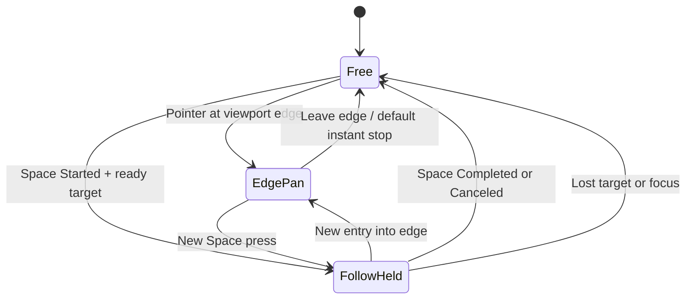

# 10-16 Dota 风格视角移动：边缘滚屏与主控单位跟随

> 状态：CAM-001 设计与 CAM-002 实现均已通过用户 review；2026-09-20 用户授权本地提交。运行验证与覆盖边界见 [实施 Spec](../Specs/CAM-002-edge-pan-follow.spec.md)。
> 更新日期：2026-09-20
> 适用基线：Unreal Engine 5.8、`Combat` 单 Runtime Module、`combat_v4_economy_rc1`

## 1. 玩家操作

普通视角移动采用鼠标贴游戏视口边缘自动平移，无需抓取键，也没有中键拖拽。相机与单位移动解耦；右键让单位移动时，默认不会把镜头拉回单位。

| 操作 | 结果 |
| --- | --- |
| 鼠标靠近视口四边或角落 | 沿对应方向持续滚屏；越靠边越快，角落不会额外加速 |
| 鼠标离开边缘 | 默认立即停止 |
| 按住 Space | 平滑跟随当前主控 `CommandedUnit`，只跟随 XY |
| 松开 Space / 输入取消 | 停在当前镜头位置；不会向单位发送 Stop |
| 跟随中鼠标重新进入边缘 | 滚屏接管；旧 Space 即使仍按住也不会恢复跟随，需松开再按 |
| 已经贴边时按下 Space | 进入跟随；原有边缘输入暂不接管，鼠标离开后再次贴边才接管 |
| HUD、日志、商店、拖放、技能瞄准或攻击选敌 | 阻止边缘滚屏，清除惯性 |
| 窗口/视口失焦、控制台打开 | 停止镜头输入并取消跟随 |

新主控单位就绪时居中一次。单位指针和绑定代次都相同的刷新不会重新居中。绑定高度作为镜头锚点 Z，之后平移和跟随均不追踪地形高度。

## 2. Dota 参考与项目选择

CAM-001 调研参考了 Dota 的 Edge Pan、Hold Select Hero to Follow 以及 Camera Speed/Deceleration。Dota 的 Camera Grip 是另一种可选输入，本项目没有采用。参考来源保留在 [CAM-001 调研 Spec](../Specs/CAM-001-dota-camera-research.spec.md)：[Valve Spring Cleaning 2016](https://www.dota2.com/springcleaning2016)、[Liquipedia Game Settings](https://liquipedia.net/dota2/Game_Settings)。

Space 键位、松开冻结、边缘接管、固定 Z 和下列数值是本项目已选择的契约，不声称与 Dota 的每个默认参数完全一致。

## 3. 运行时结构

`ACombatCharacter` 仍是 Controller 唯一 Possess 的无碰撞 Command Pawn，拥有 Scene Root、固定俯视角 SpringArm 和 CameraComponent。它没有 Combat 组件，保持 `SetReplicateMovement(false)`。真正的 Unit 继续由服务器 `ACombatUnitAIController` 驱动。

`ACombatPlayerController::PlayerTick` 在 `Super::PlayerTick` 处理完本帧输入后更新相机。Pawn 不再自行 Tick 跟随，避免双重更新。每帧刷新本地绑定，兼容 Pawn、CommandedUnit 和 Unit Owner 复制乱序；目标只来自 `GetReadyCommandedUnit()`。

| 入口 | 职责 |
| --- | --- |
| `RefreshLocalCameraBinding` | Pawn 切换清理；将就绪 Unit 和 `CommandBindingGeneration` 交给相机 |
| `IsCameraViewportFocused` | 检查 LocalPlayer、视口焦点、应用激活与控制台状态 |
| `UpdateLocalCamera` | 获取实际视口指针位置，换算 LocalPlayer 子视口，执行 UI/瞄准/触摸/出界门控 |
| `BindCameraActions` | Started 开始跟随，Completed/Canceled 结束匹配手势 |
| `SetFollowTarget(Unit, Generation)` | 绑定去重、废弃旧手势，新就绪目标只居中一次 |
| `GetEdgePanInput(Cursor, Size)` | 将视口像素位置转换为屏幕右/上方向和强度，无输入 Action |
| `BeginCameraFollow` / `EndCameraFollow(Serial)` | 使用单调按住号保护释放，旧号不能取消新会话 |
| `UpdateCamera` | 每帧只执行滚屏、跟随或自由状态之一 |
| `ResetCameraInput` | 清除旧按住号、速度和边缘接管状态，保留当前锚点 |

全部入口只允许当前本地 Controller 的 Pawn 执行。Dedicated 和远端 Controller 即使直接调用也不能移动相机；不增加 Order、RPC、Scheduler 或 Unit Transform 写入。

## 4. 状态与时序

`FollowHeld` 中的新边缘输入结束本次跟随，但保留物理按住号，直到对应释放才允许新按下。已处于边缘时按 Space 会暂时忽略该边缘，避免刚进入跟随又被旧输入撤销；移出触发带后重新武装。松开 Space 后，如果鼠标仍贴边，下一帧可以继续滚屏。

绑定指针或代次变化、Unit Owner 丢失、Unit 销毁、Pawn 更换、UnPossess、Controller EndPlay 和 `FlushPressedKeys` 均使旧输入失效。同一 Unit 的重复有效绑定不会跳镜。死亡 Actor 仍有效且仍是当前主控时可继续跟随；不自动寻找替代单位。

## 5. 参数与资产

相机参数位于 Command Pawn 的 `Camera` 分类，均带中文显示名/提示；Demo Controller 的 `CommandPawnClass` 当前使用原生 `ACombatCharacter`，需要专属配置时可指定其蓝图子类。

| 参数 | 当前默认 | 语义 |
| --- | --- | --- |
| `bEnableEdgePan` | true | 无按键边缘滚屏 |
| `EdgePanScreenThreshold` | 0.025 | 视口短边的 2.5%；1080 高时触发带约 27 px |
| `EdgePanSpeed` | 1800 cm/s | 最靠边时最大速度，0 禁用 |
| `EdgePanDeceleration` | 0 | 0 立即停止；正数为每秒指数衰减率，越大越快停止 |
| `CameraFollowSpeed` | 12/s | 跟随插值速率，0 立即对齐 |
| `bClampCameraBounds` | false | 可选世界 XY 矩形边界 |
| `CameraBoundsMin / Max` | (-5000,-5000) / (5000,5000) | 单位 cm，非法矩形忽略，不限制 Unit |

屏幕右/上分别使用相机 Right/Forward 在 XY 平面的归一化投影。合成方向再归一化，乘最大轴强度、速度和 DeltaSeconds。跟随使用 `1-exp(-speed*dt)`；可选惯性对指数衰减积分，因此相同时间内的位移不依赖帧率。UI 阻挡、指针出界或失焦始终清除惯性。

只新增一个 Boolean Action：`/Game/Combat/Demo/Input/IA_CameraFollow`。`IMC_Default` 中映射 Space，`BP_CombatDemoPlayerController` 的 `Input|Camera / CameraFollowAction` 引用它。其他 16 条映射保留。C++ 不硬编码物理 Space，旧 Controller 未配置该引用时仅禁用按键跟随。

`Tools/setup_camera_input.py` 通过 Editor API 迁移这三个精确资产；拒绝覆盖冲突 Space 或其他 Follow Action，编译蓝图并保存，可用 `-CameraReadOnly` 冷回读。UE 5.8 使用 `DefaultKeyMappings.Mappings`，不读取废弃的空 `Mappings` 字段。

## 6. 验证与复核

自动化入口 `Combat.Camera` 包含五组：自由锚点、边缘方向/阈值/帧率/高度/边界、跟随/绑定/旧释放/销毁、非本地与 Dedicated 权限、真实 Demo 输入映射与绑定事件。完整命令、结果和日志见 [CAM-002 §7](../Specs/CAM-002-edge-pan-follow.spec.md#7-测试矩阵与命令)。

PIE 与 `Tools/RunDedicated.ps1 -InstalledEditor -Camera` 在真实游戏实例和连接中注入边缘样本，核对相机位移、跟随、释放、单位不被相机修改和双客户端隔离；日志明确标记 `Input=Synthetic`。它们不代替可见窗口中的物理鼠标、Alt-Tab 和不同 DPI 手感验收。

用户实机复核：打开 `/Game/Combat/Demo/Maps/L_CombatDemo` 并进入 PIE，右键移动单位，确认镜头保持自由；鼠标贴四边/角落，移出后停止；按住/松开 Space；跟随中移出再贴边，确认滚屏接管；最后在 HUD、技能瞄准和切出窗口时确认镜头没有误移动。可按上表调整触发范围与速度。

## 7. 范围与回滚

本次不增加抓取键、缩放、旋转、小地图、相机位置存档、观战或手柄；不改玩法权威与发布 schema。回滚可恢复相机旧逻辑并移除 Follow Action/映射/引用，不回退 Unit、Owner 或 AI 移动系统。

相关入口：[10-09 输入与客户端服务器链路](10-09-Client-Server-Interaction.md)、[10-10 服务器权威单位移动](10-10-Server-Authoritative-Movement-Kickoff.md)、[ADR-061](../00-Project/00-04-Decisions-Gaps.md)、[进度台账](../00-Project/00-01-Progress-Tracker.md)。
