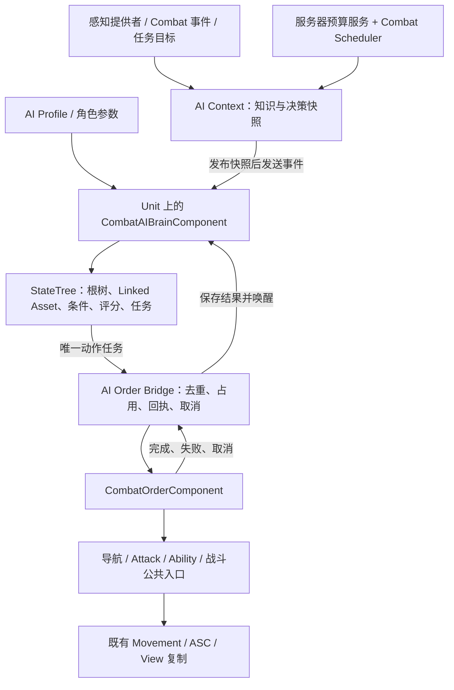
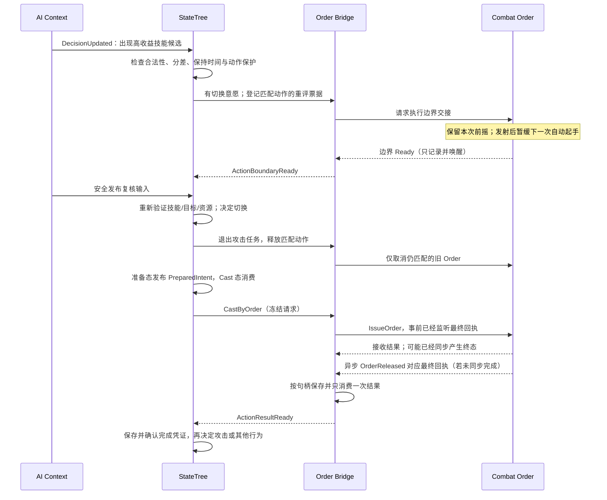

# 10-17 StateTree 通用 AI 决策系统设计

> 文档修订：0.2（2026-09-20）；2026-09-22 同步阶段 C 落地状态与容量证据，不改变用户已接受的设计基线。

> 状态：0.2 设计已由用户评审接受；AI-002 阶段 A 与 AI-003 阶段 B 均于 2026-09-21 通过用户验收，AI-004 阶段 C 于 2026-09-22 通过用户验收；D 未开始，本文不将计划或本地 Gate 等同于用户验收。
> 日期：2026-09-20；状态同步：2026-09-22；设计任务：[AI-001](../Specs/AI-001-statetree-ai-design.spec.md)；实现任务：[AI-002](../Specs/AI-002-statetree-runtime.spec.md)、[AI-003](../Specs/AI-003-statetree-roles.spec.md)、[AI-004](../Specs/AI-004-statetree-tactics-capacity.spec.md)；决策：ADR-062～065。
> 技术方向：用户明确选用 Unreal StateTree。StateTree 是唯一行为编排框架，C++ 提供节点、数据服务和 Combat 适配，不另建行为状态机。
> 事实基线：设计时的 Combat 源码、Epic UE 5.8 文档、本机安装版 UE **5.8.2 / CL 56702186** 的 StateTree 源码。本文描述完整目标架构；已落地名称、当前编排限制和资产入口以 [20-04 配置指南](../20-Content/20-04-StateTree-AI-Guide.md) 为准，其余示例仍为拟新增内容。

阶段 A 已映射为 `UCombatAIBrainComponent`、`UCombatAIStateTreeSchema`、`UCombatAIProfileData` 和 Scope/Prepare/Execute/Resolve/Wait 原生节点，保留显式 Objective 树。阶段 B 增加可选范围/LOS 感知、职责输入与 PrepareRole/ExecuteRole/ResolveRole/RoleWait/RoleCondition，资产位于 `/Game/Combat/Demo/AI/Roles`。阶段 C 增加显式 v2 Profile、HardSelect + Utility、只读技能候选、EQS 站位和 World 查询预算，资产位于 `/Game/Combat/Demo/AI/Tactics`；动态 Linked Override、完整权威可见性与 D 阶段遭遇扩展仍属后续内容。

## 1. 设计目标与适用范围

目标是让策划通过 StateTree 编排和配置复用，实现小兵、野怪、守卫、英雄机器人与 Boss；程序员只在需要新感知、新条件、新空间查询或新动作适配时扩展节点。新增一种怪物通常应只需组合子树、设置参数和选择技能使用规则。

系统分清三个问题：

1. **知道什么**：感知与记忆提供 AI 当前允许使用的信息。
2. **决定什么**：StateTree 选择目标、战术与具体动作，条件和评分解释选择依据。
3. **怎样执行**：Order、Ability、Attack、导航和 Combat Scheduler 完成已经存在的战斗执行链路。

通用性体现为明确的扩展协议和可复用子树。第一套根树可以服务常规战斗单位；复杂 Boss、护送 NPC 可以使用不同根树，共享同一 Schema、Context、任务库和执行适配。无需把所有玩法放入一棵包含大量角色类型判断的树。

本设计不同时引入 Behavior Tree/Blackboard、自建层级状态机、GOAP、LLM 决策、完整团队战略或 Mass 架构。完整迷雾、召唤物/幻象的生命周期和经济机器人另有领域依赖，不因本文示例而视为已实现。

## 2. 当前工程可复用的能力与缺口

| 当前事实 | 对设计的约束 |
| --- | --- |
| [CombatUnitAIController](../../../Source/Combat/Combat/Unit/CombatUnitAIController.h) 只负责服务器 Possess、PathFollowing 和 Crowd | Brain 放在 Unit 上，不替换 Controller，不改变玩家 Owner 或移动复制拓扑 |
| [OrderComponent](../../../Source/Combat/Combat/Order/CombatOrderComponent.h) 已执行 Move、Attack、Cast、Stop 等命令 | StateTree Task 提交意图，不直接 MoveTo、激活技能、结算伤害或控制 Transform |
| [IssueOrder 实现](../../../Source/Combat/Combat/Order/CombatOrderComponent.cpp) 会同步 Pump；替换模式取消旧命令 | 必须处理同步完成、旧命令取消回执和重复提交；不能按每次决策 Tick 重发攻击 |
| AttackTarget 是持续命令；Cast 等待 OrderReleased | 一次攻击命中不代表 Attack Task 完成；技能 Task 不等待 Projectile 命中、冷却或纯表现后摇 |
| [Scheduler](../../../Source/Combat/Combat/Scheduling/CombatSchedulerSubsystem.h) 支持游戏时间、Coalesce、预算和带代次句柄 | AI 感知轮询、记忆到期、反应延迟、失败退避统一使用该 Scheduler |
| [Targeting](../../../Source/Combat/Combat/Targeting/CombatTargetingSubsystem.cpp) 的范围查询枚举 World 单位；非 None 的 VisibilityPolicy 当前被拒绝 | 首版可以复用基础范围/LOS；大规模扫描与完整可见性必须有明确接入工作 |
| [uproject](../../../ue_gas.uproject) 启用 StateTree/GameplayStateTree；AI-002 已在 [Build.cs](../../../Source/Combat/Combat.Build.cs) 加入对应运行时模块 | 编辑器编译器依赖单独隔离；跨 Target 结果按 AI-002 实测记录 |

AI-002 已补齐最小 Profile、显式 Objective、来源仲裁和 Task 生命周期适配；阶段 A 的 Context 是 `FCombatAIContext`，工作区与 Bridge 由 Brain 内部持有。AI-003 已补齐知识快照、自动感知和角色职责，AI-004 已补齐 v2 战术、技能候选、EQS 与查询预算；完整权威可见性和 D 阶段遭遇服务仍是后续扩展。

## 3. 总体结构与职责



### 3.1 运行对象

| 总体设计对象（部分已落地） | 职责与所有权 | 不承担的职责 |
| --- | --- | --- |
| `UCombatAIBrainComponent : UStateTreeComponent` | Unit 默认子对象；服务器启动/停止唯一 StateTree 实例，建立上下文、持有服务和 Order Bridge，管理本次运行代次 | 不内置另一套 Patrol/Combat/Return 状态机，不接管导航 |
| `UCombatAIStateTreeSchema : UStateTreeComponentSchema` | 限定 Context Actor 为 Combat Unit，提供类型化 Context/外部数据，约束允许的节点，显式允许 Scheduled Tick | 不保存各单位运行状态 |
| `UCombatAIContext` | Brain 每次运行拥有的实例对象；保存观察记忆、职责目标、已发布决策快照、独立的决策工作区和诊断信息 | 不成为第二套 Health/Mana/冷却/队伍权威 |
| `FCombatAIOrderBridge` | Brain 内部持有的适配对象；维护动作句柄、命令对应关系、最终结果、边界交接票据和取消协议 | 不拥有第二个 Order 队列，不直接操作 Attack/Ability registry |
| `UCombatAIWorldSubsystem` | 每个服务器 World 的预算与注册服务，组织分批感知/空间查询，统计负载；仍通过 Combat Scheduler 安排工作 | 不选择单位行为，不建立独立游戏时钟 |
| `UCombatAIProfileData : UCombatDefinitionData` | 配置根树、子树覆盖、感知/目标/技能/预算策略，提供稳定 DefinitionId | 不保存 CurrentTarget、运行句柄或可变仇恨 |

命名是设计建议，职责边界是实现约束。Brain 内部服务先用结构/组合对象表达，不为每条规则增加 ActorComponent；只有需要独立复用和生命周期时再拆分。

### 3.2 启动与控制来源

Brain 的自动启动关闭。只有服务器确认 Unit/ASC/生命状态/Order/导航控制器已就绪、Profile 已加载且当前允许自主控制后，才建立 Context 并调用 `StartLogic()`。

Context 发布、事件收纳、StateTree 操作和 Order 提交都在服务器游戏线程执行。以后若把候选计算放到工作线程，只能返回不可变计算结果，回到游戏线程再次核对运行/查询代次后采用；工作线程不能访问活动 Task 数据或提交 Order。

单位可处于自主控制、玩家指挥或脚本接管三种**命令来源模式**。它们只是指令提交资格，不是另一套 AI 行为状态机。网络 Owner、PlayerController 绑定和 Team 仍遵守 [10-09](10-09-Client-Server-Interaction.md) 与 [10-10](10-10-Server-Authoritative-Movement-Kickoff.md)。

- 没有 Profile 的旧单位保持原行为，不自动索敌。
- 玩家主控单位默认采用玩家指挥模式；配置了 Hero Bot Profile 不等于获得自主提交资格。
- 自主 AI 在服务器本地提交 Order，不伪造玩家 RequestId，也不绕到客户端 RPC。
- 玩家命令仍先经过现有所有权、载荷、重放、限频与业务预检。合法接管先撤销 AI 提交资格和旧动作，再执行玩家命令。
- 第一次玩家接管时，即使请求为追加，也先结束自主动作；之后玩家自己的 FIFO 语义保持不变。AI 停止期间不得清理玩家后续队列。
- 玩家下达 Stop 后不自动恢复自主攻击；恢复 AI 需要明确的模式切换或 Profile 规定的服务器规则。
- 脚本接管必须由服务器授权入口取得资格，不能仅凭任意 Task 填写更高优先级抢占。

## 4. StateTree 原生机制的使用约定

### 4.1 活动路径、并行任务与完成条件

StateTree 激活根到叶的状态路径，同一状态中的 Tasks 以及活动父状态的 Tasks 可以同时运行。因此“在同一状态里依次摆放查目标、移动、施法”不等于顺序执行。需要先后依赖时使用不同状态，以任务完成转移连接。

本机 UE 5.8.2 支持状态任务完成策略 `Any`/`All` 和任务的 `bConsideredForCompletion`。本方案规定：

- 每条活动路径最多一个**命令写入任务**，包括所有 Linked Asset 展开的路径。
- 观察、快照或诊断服务不参与动作状态完成；Global Task 不因为“一次数据更新完毕”返回成功，避免结束所在执行帧。
- 普通动作叶状态只放一个参与完成判断的任务，明确采用其成功/失败转移。
- 确需多个任务共同完成时显式选择 `All`；同时审查每个任务能否结束、失败怎样传播和取消怎样清理。
- 允许并行的工作限于无命令写入冲突的观测/表现辅助。并行战斗动作子树不在首期节点白名单中。

不要将旧版概览中的“首个任务完成就切换”当成所有 UE 5.8 状态的固定规则。实现须使用实际引擎的编译结果和完成策略验证，不能依赖默认值。

### 4.2 Context、参数、Evaluator 与 Instance Data

| 机制 | 放什么 | 更新方式 |
| --- | --- | --- |
| Context / External Data | Unit、Brain、AIContext、Order 和公共查询服务的类型化引用 | 宿主启动/执行时校验同 World、服务器权限和有效性 |
| Tree / Linked State Parameters | 职责、警戒/追击范围、技能使用策略等配置，以及显式声明的本次子树输入 | 配置在启动前从 Profile 解析；动态输入在进入子树时从工作区绑定并冻结，不写回资产默认值 |
| Evaluator | 暴露只读数据和廉价派生值 | 不执行全局扫描，不下命令，不依赖逐帧 Tick 刷新权威事实 |
| Condition / Consideration | 能否进入状态、收益评分 | 无副作用，读取同轮观察快照及当前已提交的准备结果/回执状态，可重复求值；不能在求值时生产或消费结果 |
| Task Instance Data | 本次动作输入快照、任务激活代次、ActionHandle、查询/调度句柄 | 每实例独立，随 Enter/Exit 管理 |

资产节点结构和 CDO 不能保存单位私有状态。不得把临时 `FStateTreeExecutionContext&`、Task Instance Data 的裸地址或栈上数据捕获进跨帧回调；回调持弱 Brain 引用和稳定句柄，结果由仍活动的节点在合法执行上下文中读取。

禁用 Task Tick 后，不应假设其绑定属性还会逐帧复制。提交动作时把输入复制为不可变请求；执行中需要重评时读取新 `SnapshotRevision`，经明确转移决定是否换动作，不能让绑定值悄悄改掉已提交命令的目标。Exit 取消只认 Instance Data 中的句柄，不认可能刚被重新绑定的 Target。

### 4.3 选择、评分与重新选择

根树的硬优先级采用 `TrySelectChildrenInOrder`；英雄战术可使用 `TrySelectChildrenWithHighestUtility` 与 Considerations。合法性由 Enter Conditions 判定，评分只比较合法候选。不能用得分为零代替不合法。

引擎只在选择/转换发生时执行相应选择流程；“节点放在前面”不意味着它会自动抢占当前动作。需要明确配置 `DecisionUpdated` 等事件转移及中断条件。最高效用同分按子状态顺序选择；目标候选同分使用本局稳定标识排序。首版不用原生随机选择表达 gameplay 随机策略，避免未经评审地引入与 Combat RNG 不同的随机流。

持续服务和占用型任务检查 `bShouldStateChangeOnReselect`：保持活动时不能重复绑定或重复提交。一次性动作需要真正重新进入才获得新 TaskActivationSerial。相同任务标志不替代 Bridge 去重；父状态重选、Linked Asset 切换和新输入仍须分别测试。

## 5. 知识、职责与配置的数据契约

### 5.1 AI Context 中的数据

| 数据组 | 主要字段 | 约束 |
| --- | --- | --- |
| 身份 | Self 弱引用、SelfLifeGeneration、TreeRunGeneration、CommandAuthorityEpoch | 重生、重启、控制来源变化使旧工作失效；不替代现有网络绑定代次 |
| 职责 | HomeAnchor、PatrolRoute、RouteCursor、Objective、FormationSlot（可选） | 地图/任务提供职责，树选择怎样执行；HomeAnchor 与当前 MoveGoal 分开 |
| 知识记忆 | 目标身份/生命代次、LastSeenPosition、LastSeenAt、信息来源、置信度、受击威胁、失效时间 | 失去感知后不继续读取敌人的实时位置、生命或技能状态 |
| 决策快照 | SnapshotRevision、ObservedAt、合法候选摘要、自身资源/标签查询结果、空间候选、行为评分输入 | 只是本轮只读采样；执行仍由 ASC/Targeting/Order 重新验证 |
| 决策工作区 | DecisionScopeHandle、PreparationSerial、PreparedIntent、CompletionReceipt | 类型化跨状态交接数据；由活动 Task 写入，不修改本轮观察快照，不保存另一套行为状态机 |
| 运行诊断 | 活动 ActionHandle、最近选择原因、失败原因、退避截止时间、事件消费序号 | 不保存另一份战斗最终结果或施法阶段 |

自己和可观察对象的属性来自 ASC 公共读取。敌人知识只在感知许可时更新；丢失目标后保留的是历史观察。跨轮短暂缓存必须带时间与修订号，不能把缓存当成权威属性来源。

### 5.2 Profile 配置

建议 Profile 包含以下配置组，均提供中文 `DisplayName`、`ToolTip`、单位、范围和空值语义：

| 配置组 | 内容与示例 | 无效/空值处理 |
| --- | --- | --- |
| 树与角色 | RootTree、按 StateTag 指定的 Linked Asset 覆盖、参数集 | 无根树则不启动；Schema 不匹配或链接循环拒绝加载 |
| 感知 | 来源类型、警戒半径、LOS 要求、记忆时长、刷新间隔 | 必需提供者缺失则拒绝该 Profile；不回退全知模式 |
| 目标选择 | 目标类别优先级、威胁/距离/职责权重、切换分差与保持时间 | 无合法目标走职责/等待；未知目标类别不能自动获得最高优先级 |
| 战斗约束 | 最大追击距离/时长、撤退阈值、回归规则、动作保护策略 | 数值必须有限；0 的禁用或立即触发语义逐字段定义，不隐含无限追击 |
| 技能使用 | Ability DefinitionId、用途、优先级、资源保留、目标策略、最小有效目标数 | 技能未授予或不支持则跳过并诊断，不临时授予技能 |
| 空间查询 | EQS 资产、采样半径、有效期、失败回退 | 查询为空时使用已定义的简单战术，不直接调用导航代替 Order |
| 预算 | 感知档位、候选/记忆上限、最多在途查询、重评间隔 | 越界拒绝或按明确规则裁剪；裁剪规则进入诊断 |

配置覆盖次序固定为：树参数默认值 → Profile → 服务器出生/任务允许覆盖的实例参数。实例覆盖只开放白名单字段；运行时不得任意替换策略资产。行为类型由树和子树表达，参数不会再解释一套脚本流程。

### 5.3 准备结果与跨状态交接

`SelectKnownTarget → AttackByOrder`、`QueryTacticalLocation → MoveByOrder` 是不同状态中的顺序步骤。不能把前一个兄弟状态的 Task Instance Data 当成后一个状态的绑定源：本机编译器按可访问执行路径检查绑定，退出的兄弟任务不在该路径中。

使用拟新增的 `FCombatAIDecisionWorkspace`，由 AIContext 持有，分成准备意图与完成凭证两个有类型的槽。它与只读观察快照分离：感知服务发布事实，活动 Task 生产/消费工作区结果，条件与评分只读取；工作区不向客户端复制。具体契约如下：

| 字段/对象 | 内容与所有者 | 有效边界 |
| --- | --- | --- |
| DecisionScopeHandle | 运行/自身生命/控制代次 + ScopeSerial；共同父状态的无 Tick 服务创建，服务不参与完成 | 保持该父状态活动时不重新创建；离开作用域或宿主停止即失效 |
| PreparationSerial | 作用域内开始一轮准备时递增；每次只允许一个生产者 | 新准备使旧异步查询及未消费意图失效；普通 SnapshotRevision 更新不自动递增 |
| PreparedIntent | Kind、目标弱引用/生命、AbilitySpec/物品修订、目标点、职责修订、观测时间、有效期，以及 ExpectedConsumerSlot | 仅允许指定消费位置；带 Scope/Preparation 身份和必要依赖修订，不能只凭 Actor 指针复用 |
| CompletionReceipt | 来源（准备/动作）、Scope/准备身份、可选动作/Order 句柄、Success/FailureTag、到达等观察证据、未确认序号 | 准备失败或动作终态形成类型化凭证，供后续结果处理任务使用；不是新的战斗结算结果 |

准备过程遵循以下顺序：

1. 准备 Task 在 Enter 中开始新 PreparationSerial。同步选择直接形成完整 PreparedIntent；异步查询只提交请求，回调将原始结果放入按句柄索引的 inbox，活动准备 Task 在合法 Tick 中核对后才发布意图。准备失败则留下无 Order 句柄的失败凭证，不能把半成品标为可消费。
2. 成功准备只向声明的下一步转移。生产者的正常 Exit 取消遗留订阅/查询，但**不删除已经发布的意图**；意图依赖 Scope/Preparation 的存活，不依赖已经退出的生产者 TaskActivationSerial。
3. 动作 Task 从共同 Context 读取指定槽，校验 Scope、Preparation、ConsumerSlot、相关目标/职责/物品修订和有效期，再复制成自身不可变请求，标记该意图已消费，然后向 Bridge 提交。输入失效或提交被直接拒绝也要留下类型化失败凭证，再返回 Failed；不能让后续失败处理无结果可读。失效输入不提交 Order。
4. 动作收到终态时，先形成 CompletionReceipt，再返回 Succeeded/Failed。后续 `ResolveActionOutcome`、`CommitHomeArrival` 或路线推进任务按序号只确认一次。Bridge 的动作结果槽可以在转交后清理，完成凭证不随前一动作 Task 的 Exit 消失。
5. 取消准备、切换目标/职责、离开作用域、接管、重生或换树时，废弃未消费意图、未确认凭证及旧查询。紧急中断可以明确放弃后续路线/归位记账；已经发生的伤害、技能消耗和弹体不因此回滚。

同一作用域只保留一份待消费意图和一份未确认完成凭证；未确认凭证存在时，不开始下一轮普通准备。Linked Asset 使用继承的 Scope 和显式 ConsumerSlot，不能自行覆盖其他作用域的槽。动态输入从 Context 绑定或由节点类型化读取；不依赖兄弟 Task 的地址，也不把参数当共享 Blackboard。

快照修订仅用于追踪输入来源。新快照发布但查询依赖未变、结果仍在有效期内时允许采用；目标生命、职责修订或查询参数变化才使对应结果失效，避免每次感知刷新都废掉在途 EQS。阶段 A 必须验证“准备态退出后仍能消费”和“中断后绝不能消费”这两个方向。

## 6. 根树与可复用子树

### 6.1 标准战斗根树

以下是建议资产结构，文本树只描述 **StateTree 编辑器中的组织**：

```text
ST_CombatAgentRoot
  Global：提供只读 Context / 诊断（不下命令、不参与完成）
  Autonomous                         宿主已经确认自主控制资格
    GoalSelector                     按顺序选择
      Emergency                      仅 Profile 明确允许的紧急响应
      ReturnToAssignment             脱战归位/任务强制回归
      Combat                         有可交战候选或仍有效的当前目标
        AcquireTarget                SelectKnownTarget；成功后继续
        Execute                      Linked Asset：战斗战术
      RoleDuty                       Linked Asset：推进/巡逻/守点/跟随
      Idle                           等待事件或 Scheduler 唤醒
```

死亡、World teardown 和玩家接管由宿主同步撤销执行资格并停止树，不等待树选中某个 Dead/Manual 子状态。眩晕、定身和 Motion 对已经接受的 Order 的暂停/恢复仍由现有战斗系统处理；树只通过合法性和保护条件判断是否有其他可选行为。

示例转移规则：

| 当前分支 | 触发 | 条件 | 转移 |
| --- | --- | --- | --- |
| RoleDuty / Idle | `DecisionUpdated` | 获得合法目标且允许交战 | 重新选择 GoalSelector |
| Combat | `DecisionUpdated` | 超出职责边界、目标丢失或战术变化达到门槛 | 根据保护策略重新选择目标/战术 |
| Combat | 当前动作失败 | 无已生效的事件转移；有匹配完成凭证 | 先解释/确认结果，再按 FailureTag 退避、重选或 ReturnToAssignment |
| ReturnToAssignment | 受击/新敌出现 | 默认归位期间不允许重新接战 | 保持归位，不因普通感知事件重选根分支 |
| ReturnToAssignment | 到达职责点 | 当前 Move 成功且职责条件复核通过 | 清理归位上下文，重新选择 |
| 任意运行分支 | 宿主资格失效 | 死亡、接管或 teardown | 立即使动作失效并 StopLogic |

紧急响应和归位谁优先由角色树定义；紧急分支必须有可观察触发条件和退出条件。不能在引导期间无条件执行全树自转移。

本机 UE 5.8.2 的 `TriggerTransitions()` 先处理请求及事件/Tick 等转移，**只有尚未选中转移时才处理完成转移**。前者使用 Transition Priority 仲裁；完成转移沿完成状态向父层查找，按有效转移顺序尝试，不参加同一组 Priority 竞争。不能通过提高完成转移的 Priority 让它抢在普通事件前面。该处理阶段是当前源码事实，升级引擎时须复核。

本方案在这一语义上配置业务仲裁：

| 同轮输入 | 允许的推进方式 | 数据处理 |
| --- | --- | --- |
| 死亡/撤权/teardown 与任意结果 | 宿主先同步失效并停止树 | 清理自身工作，旧结果不得启动新命令 |
| 明确允许的紧急事件与动作完成 | 紧急事件可以先于完成流程生效 | 废弃旧作用域中未确认的行为记账；不回滚 Combat 已结算事实 |
| 普通 DecisionUpdated 与动作终态/未确认完成凭证 | 普通重评条件返回 false；先完成动作和后续结果处理 | 重评原因保持为脏标记，确认凭证后安排下一次安全唤醒 |
| 仅普通重评，当前动作仍 Running | 满足分差、保持时间与动作保护才允许事件转移 | 同目标、同动作不强制重进；需要交接时遵守 §8.5 |
| 没有可用事件转移，状态已完成 | 执行条件明确的成功/失败转移 | 特定失败分支在前，兜底在后；不靠 Priority 区分完成出口 |

普通重评的统一条件同时检查 Bridge 是否已有终态、工作区是否有未确认 CompletionReceipt，不能只检查事件到达顺序。完成后的推进游标、确认归位等步骤放在无 Order 写入的短同步状态中；这些状态没有普通重评出口，且其准入不能被新索敌结果阻断。确认完成凭证后再重选根分支。若是宿主强制终止或允许的紧急打断，则明确放弃该凭证，不从 Exit 隐式执行成功记账。

紧急事件的 Priority 高于普通事件；同级冲突必须由互斥条件或不同 Priority 消除，不把父子遍历顺序当产品规则。一次仲裁只采用一个转移，但引擎可能在同次处理内继续推进同步状态；验收应断言一次结果只记账一次，而非声称一帧最多一次状态转换。

### 6.2 子树的组合契约

| 拟建子树 | 输入 | 行为与结束语义 |
| --- | --- | --- |
| `ST_CombatPatrol` | 路线/巡逻规则 | Move 到航点 → 成功后推进游标 → Scheduler 等待；受允许的交战事件打断 |
| `ST_CombatLaneAdvance` | 路线与推进目标 | 无敌人时推进；战斗结束从有效路线进度继续，不重走出生点 |
| `ST_CombatGuard` | 锚点、警戒与追击约束 | 守点/交战/归位；保持职责范围 |
| `ST_CombatEngage` | 当前合法目标、战术与技能规则 | 在施法、战术移动和持续攻击之间选择；每条路径一个动作 |
| `ST_CombatReturnHome` | 锚点、复位策略 | 安全结束旧动作 → Move → 到达复核 → 可选通过公共 GE/API 复位；失败有出口 |
| `ST_CombatRetreat` | 可观察威胁、撤退点策略 | 查询撤退点 → Move → 到达后重评；查询失败使用预先定义的职责点回退 |
| `ST_CombatBossPhase` | 遭遇阶段事实、招式配置 | 用不同阶段的 Linked Asset 编排；阶段事实来自遭遇系统或只读条件 |

根树用稳定 StateTag 标记可替换位置，例如拟新增的 `Combat.AI.Slot.RoleDuty` 与 `Combat.AI.Slot.Combat`；Profile 通过 `FStateTreeReferenceOverrides` 及宿主的 Linked StateTree override 接口装配，采用精确 Tag 匹配。

子树共享同一 Schema 和 Brain Context。输入通过类型化参数/绑定接收配置、Scope 和 ConsumerSlot，动态准备结果遵守 §5.3。`FCombatAIActionResult` 先由 Bridge 按动作句柄保存，再由动作 Task 转为工作区 CompletionReceipt；子树完成前确认或显式转交凭证，以成功/失败返回控制流。Linked Asset 参数不用于任意回写父树。

Linked Asset 的 Global Tasks 随对应执行帧工作，不能重复注册整只单位的永久感知/Combat 订阅；这些订阅由 Brain 唯一持有。禁止链接循环；RootTree/Overrides 在 StartLogic 前冻结。换 Profile 时走停止、清理、增加运行代次、装配并重新启动的完整流程，不在运行中热换资产。

### 6.3 英雄的效用选择

英雄可以覆盖战斗子树，用 StateTree 最高效用选择器组织 `Cast`、`Attack`、`Reposition`、`Retreat`；紧急回归/控制权约束仍是上层硬条件。

评分节点把可观察收益和代价映射到有界分数，例如治疗缺口、有效命中数、职责偏离、暴露风险和法力保留。评分不能提交命令或查询未知敌人。新行为分数必须超过当前行为的切换门槛，且满足最短保持时间与动作保护条件；目标死亡/失效等硬失败不受保持时间阻挡。

这些保持门槛控制何时触发 StateTree 重选，不在树外保存 Patrol/Combat 等行为状态。目标/技能候选排序可以是纯 C++ 算法，最终行为分支仍由 StateTree 选择。

**版本边界：** `FStateTreeConsiderationBase` 在本机 UE 5.8.2 头文件及 [官方 API](https://dev.epicgames.com/documentation/unreal-engine/API/Plugins/StateTreeModule/FStateTreeConsiderationBase) 中仍标为实验性，不能把 Consideration 的接口稳定性当成保证。评分公式、归一化和同分规则写成无引擎执行上下文依赖的纯函数，Consideration 仅负责读输入并调用，降低升级时的迁移范围。

阶段 A/B 使用 StateTree 原生有序选择和进入条件。AI-004 已在安装版 UE 5.8.2 / CL 56702186 与源码版 UE 5.8.2 / CL 0（Compatible CL 55116800）完成 Consideration 编译、选择结果、Linked Asset、三个 Target 与 Windows cook 准入；只有显式 v2 Profile 才启用 Utility，v1 继续走有序树。准入失败时仍应拒绝或延期该 Profile，不在 C++ 偷换另一套行为决策器。每次引擎升级重新执行该门，实验性资产变更需要迁移记录。

## 7. 感知、目标选择与空间决策

### 7.1 感知来源与知识限制

感知提供者可以组合：范围/LOS 查询、受击事件、任务指定目标、队友共享情报，以及可选的 UE AI Perception。AI Perception 只作为感官适配器，不能替代 Combat 阵营、可见性与命中合法性规则。

提供者先形成候选，再用公共 Team/Targeting 规则筛选，最后发布知识快照。受击事件是否透露攻击者身份和位置必须由感知策略决定，不能因为服务器日志里存在 Source Actor 就默认全知。

首个可玩配置使用明确的“范围 + LOS”感知模型。它不是完整迷雾：当前 `VisibilityPolicy=None` 没有完整权威视野语义。将来需要战争迷雾、隐身/真视时，先为 Combat Targeting 接入统一权威可见性提供者，再让 AI 消费其结果；缺失提供者时拒绝需要该能力的 Profile。

目标丢失后只允许按 LastSeenPosition 发点移动或执行明确允许的盲放策略。不能继续把隐藏目标 Actor 作为 MoveToUnit/AttackTarget 的跟踪对象。现有 Order 会读取目标实时位置，因此感知失效时必须取消自己持有的跟踪命令；检测精度受感知更新间隔影响，首期测试需明确这一边界，不能承诺零延迟迷雾公平性。

### 7.2 目标选择

统一流程为：候选来源 → 合法性过滤 → 职责约束 → 角色优先级 → 评分 → 保持/切换判断。禁止直接比较 TeamId 或自行实现一套目标状态规则。

- 小兵：依据目标类别和职责优先级选择，限制偏离路线的距离。
- 野怪：按感知许可的受击威胁与距离选择；威胁记忆是 AI 私有行为数据，不改写战斗伤害结果。
- 守卫：职责区域和保护对象优先。
- 英雄：结合可观察的击杀/保护机会和风险；不把野怪仇恨表强加给英雄。
- Boss：允许脚本目标策略覆盖常规排序，但必须先通过公共合法性检查。

CurrentTarget 包含弱 Actor 身份和 LifeGeneration；Actor 原地重生不能自动继承旧目标资格。短暂不可达与真正失效分别处理；暂时不可达可进入有截止时间的目标排除表，禁止永久拉黑或每帧重试。

### 7.3 EQS 的边界

EQS 用于选择“站哪里”：撤退点、射程内位置、绕开危险区域的位置。它返回候选点/评分，最终移动仍由 Move Order 执行，并重新校验导航与职责约束。[EQS 官方概览](https://dev.epicgames.com/documentation/unreal-engine/environment-query-system-overview-in-unreal-engine)

查询同时保存 QueryId、QueryGeneration、发起时的运行/控制/自身生命、Scope、职责修订、目标弱引用/生命及 SnapshotRevision；完成时确认仍是同一引擎查询与同一业务查询。Task Exit、Scope 结束、换 Profile、接管、死亡、EndPlay 和 World teardown 先使工作区身份失效，再精确 Abort；World token 只结算一次。战术上下文变化后旧结果不能写入新目标，每只单位最多一个在途查询。

若 AI 已用战术 EQS 选定点，该单位的现有 `MoveDestinationQuery` 应为空，避免 Order 再次查询后改变落点语义。需要两阶段修正时必须另定义契约，不能隐式叠加两个 EQS 选择器。

## 8. StateTree Task 与 Order 的适配契约

### 8.1 动作身份、占用与去重

每次动作申请一个 `FCombatAIActionHandle`，内部关联 TreeRunGeneration、SelfLifeGeneration、CommandAuthorityEpoch、TaskActivationSerial 和最终 OrderHandle。Target 的生命代次另存于请求快照。这些是服务器局部身份，不复用网络 RequestId。

动作占用表示“当前哪个任务有资格控制这只单位的 Order”。Bridge 是 AI 唯一提交入口；同一活动路径的第二个写入者被拒绝并诊断。玩家/脚本的合法接管先使旧占用失效。AI 默认 `bQueue=false` 且不预先灌入多步 FIFO，步骤顺序由 StateTree 表达。

Bridge 为命令生成语义键：类型、目标及其生命代次、AbilitySpec、相关参数；点移动使用明确的位置容差。相同任务继续持有相同动作时复用已有句柄，不重发。目标保持不变但 SnapshotRevision 更新，不构成新命令。不同任务不能仅因语义相同就窃取旧占用；若要转交，必须显式记录旧/新激活身份并保证只有一次交接。

### 8.2 接收结果与最终结果

| 动作任务 | Task 保持 Running 的期间 | 成功/失败的来源 |
| --- | --- | --- |
| MoveToPoint | 导航与 Order 自己的有界重试 | 匹配 OrderHandle 的最终回执；接受命令不算到达 |
| MoveToUnit | Order 跟踪至满足到达条件 | 同上；目标丢失/死亡按失败原因交给树处理 |
| AttackTarget | 持续追击/转身/普攻，包括 attack-ready 等待 | 不按单次发射/命中成功完成；目标失效或命令终结形成结果，由交战子树解释 |
| CastNoTarget / CastPoint / CastTarget | 追近、转向、前摇及需要等待的引导 | 现有 OrderReleased 导致的 Order 最终回执；不等冷却、后摇或飞行弹体 |
| CancelOwnedAction | 对指定仍有效动作取消 | 使用专门的取消协议；不把通用 Stop 当作普通异步动作来等待同句柄回执 |

目标被击杀时底层 Attack Order 可能以目标失效结束。交战子树可据可观察上下文把它解释为“当前交战目标结束”，然后重选；不改写底层 FailureTag，也不一律把目标失效认定为 AI 故障。

### 8.3 防止同步完成漏接

`IssueOrder()` 内部会调用 `PumpCurrentOrder()`；因此下列提交协议是必须项：

1. Brain 启动时先绑定唯一的 `OnOrderFinished` 监听；Bridge 创建临时提交记录后再调用 IssueOrder。
2. 提交调用栈内发生的最终回执先按完整 OrderHandle 保存。替换旧命令产生的取消回执可能先到，不能把它当成新动作结果。
3. IssueOrder 返回后，使用其 Handle 绑定新动作并匹配缓存结果。即使返回 State 为 Validating，也不能忽略此前已经到达的终态。
4. 立即拒绝按返回失败结束；正常异步回执之后完成；重复/迟到回执只消费一次。缓存有上限并在本次提交对齐、动作释放或运行终止时清理。
5. 回执只记录结果并安排 StateTree 唤醒，不在 Order 广播栈中递归切树、启动新 Order 或持有 ExecutionContext 引用。

任务在合法 EnterState 或事件触发的 Tick 中读取匹配结果，再返回 Succeeded/Failed。对于同一结果，只采用“Task 完成 → 完成转移”这一条推进路径；不要再配置第二条 `OrderFinished → 直接跳状态` 来重复消费。

### 8.4 退出、取消和抢占

ExitState 的协议是：使当前 TaskActivationSerial 失效 → 解绑任务级观察/取消查询与 Schedule → 通过 Bridge 释放该动作 → 仅在 OrderHandle 仍匹配且命令仍归该动作时取消执行。正常完成后 Exit 不得再次取消。

撤销执行资格和完成清理分开：Bridge 暂存只用于清理的旧动作记录与 ExpectedOrderHandle，禁止它再次提交命令，但仍允许对这个精确旧句柄做幂等取消。否则先增加运行/控制代次就可能使清理入口也失效。新控制者命令进入后，句柄比较失败，旧清理自然成为无副作用操作。最终结果保留到对应 Task 消费或动作退出，不能收到回执就先删除结果槽；需要后续记账时，先转交 §5.3 的 CompletionReceipt，再释放 Bridge 槽。

当前 Order 公开面只有 StopAllOrders，没有按匹配句柄取消的原子入口。建议后续增加最小公共接口，例如 `CancelCurrentOrderIfMatches(ExpectedHandle, Reason)`：在同一服务器调用中比较完整句柄并取消当前项，失配无副作用；不允许取消其他控制者的新命令或其排队项。现有清队列语义与该接口的内部清理关系要通过专项测试确认，不能直接把 StopAllOrders 重命名当作实现。

常规战术切换遵守动作保护：攻击前摇默认保持至发射或有效终结，引导默认等待释放，只有配置允许的紧急策略主动取消。保护窗口读取现有 Attack/Order/Ability 状态或其只读适配，不用估算的动画时间另建计时器。死亡、控制权移交和原有强制中断不受 AI 保持时间阻挡。

StateTree 条件转移可能不调用 StateCompleted，所以资源清理必须放在 Exit/宿主终止的幂等路径，不能只放在 StateCompleted。具体节点如何在保持活动的重选中避免重复 Enter/Exit，需要和语义键、ActionHandle 一起验证。

### 8.5 动作保护解除与下次攻击的交接

仅在每次感知刷新时读取“当前是否前摇”不能保证普通战术最终能切换。例如攻击周期 0.4 秒、前摇 0.3 秒、重评间隔 0.2 秒，采样可能一直落在前摇内。这是需要验证的时序反例，不是本次实测结果。

现有 `OnAttackLaunched` 可以报告攻击发射，`HandleAttackReady` 会直接 Pump 持续 Attack Order。**当前 Order 没有为 AI 保留重评机会的接口**；只订阅发射事件而不控制下一次自动起手，在卡顿或极短后摇下仍可能错过窗口。后续为 Order 增加按完整句柄匹配的执行边界交接，设计接口暂称 `RequestDecisionBoundaryIfMatches` / `ReleaseDecisionBoundaryIfMatches`。它不是另一个命令队列，也不把攻击计时移交给 AI。

| 步骤 | 所有者与动作 | 必须保证的结果 |
| --- | --- | --- |
| 请求重评 | 当前动作 Task 在合法事件 Tick 中运行纯切换意愿判断，确有普通切换需求时，向 Bridge 申请一张 ReevaluationTicket | 票据带 Action/Order、运行/控制/任务身份和原因序号；同动作重复请求合并；条件节点本身不写票据 |
| 等待保护解除 | Bridge 在 Order 登记匹配句柄的交接请求；已在合法边界则立即记为 Ready，否则等待真实发射/有效终结 | 不取消本次前摇，不改变攻速/AttackReady 时钟；记录待重评原因，不把旧技能候选视为已决定的下一命令 |
| 到达边界 | Order 标记票据 Ready，向 Brain 写入边界通知，阻止同一 Order 的下一次自动攻击起手 | AttackReady 仍按原时钟发生；所有可能启动下一次攻击的入口统一检查交接，不能只拦一个回调 |
| 安全处理 | Brain 合并并发布需要复核的数据，再唤醒树；动作 Task 和转移条件重新检查目标、资源、分差和保持时间 | 在 Combat 广播栈外处理；Ready 通知本身不算 Attack Task 成功、不直接触发施法 |
| 继续当前动作 | 新条件不再支持切换时，当前动作 Task 确认 Keep；Bridge 释放匹配票据 | Order 在安全处理点按原 AttackReady 状态复核并继续；不重发 Attack Order、不重置攻击间隔、不补发积压攻击 |
| 采用新动作 | StateTree 选择新分支，旧动作 Exit 精确取消旧 Order/交接，后续准备与动作任务提交新意图 | 保持一个写入者；旧票据无法恢复已经取消的攻击，更不能干扰新命令 |
| 超时/退出 | Ready 后的 HoldTimeout 由 Combat Scheduler 安排，示例起点 0.25 秒；超时释放匹配交接并诊断；接管/死亡/退出按旧身份清理 | 超时仅解除交接，由仍合法的旧 Order 自行复核；失配或已取消时无副作用，不能恢复旧控制资格 |

HoldTimeout 从 **Ready 时刻** 开始，不在受保护前摇尚未结束时倒计时；否则长前摇会让票据每次提前失效。票据最多一张，等待/Ready 阶段的事实由 Bridge 与 Order 保留，通知可合并和重发。边界复核使用独立的有界处理额度，不排在普通全 World 感知扫描之后；若连续超时，报告交接饥饿并视为容量验收失败，不能靠无限延长停打掩盖。

若无法创建 HoldTimeout 调度，则不保持停打交接，撤销该票据并报告调度故障。超时释放同时使 Bridge 的 Ready 事实失效；StateTree 真正转移前再次核对票据仍 Ready、Order 仍匹配且动作仍允许切换。迟到的 Ready 事件不能让树跳过已经重新开始的前摇保护。

如果 Request 与 AttackReady 同轮发生：在下一次起手前已登记则先保留交接；若下一次前摇已经合法开始，等待该次真实边界，不反向取消它。重复/迟到 Ready、超时、Keep 和 Exit 都比较同一 TicketSerial 与完整 OrderHandle，只有一次释放。故意允许打断前摇的紧急策略及死亡/撤权仍遵守 §8.4，不经过普通等待协议。

施法引导通常在 OrderReleased 后已经形成终态，走完成凭证和 §6.1 的完成流程，不再额外生成一条“边界事件直接跳状态”的并行完成路径。Attack 发射后的弹体/近战结算继续由原 Combat 执行；交接只限制下一次自动起手。

## 9. 事件与调度

### 9.1 两种调度的职责

**Combat Scheduler 决定 gameplay 工作何时到期，StateTree 原生 Scheduled Tick 决定树何时处理已到达的信息。** 两者不重复驱动同一个行为，也不手动从多个入口调用 StateTree ExecutionContext 的 Tick。

| 工作 | 调度来源 | 到期行为 |
| --- | --- | --- |
| 感知刷新、目标重评、记忆过期 | Combat Scheduler，周期使用 Coalesce | 请求预算、计算快照、发布 SnapshotRevision、发送一次唤醒 |
| 反应延迟、任务等待、失败退避 | Combat Scheduler，一次性句柄 | 验证运行/任务代次后写入到期结果并唤醒 |
| Order/受击/目标/控制变化 | 既有服务器事件 | 标记脏数据或动作结果；结构修改延迟到安全处理点 |
| StateTree 条件、任务结果和转移 | 原生组件的事件/调度 Tick | 消费已经发布的信息，推进活动路径 |
| 攻击前摇、技能引导、追击、导航 | 现有 Combat 执行系统 | AI 不重复安排前摇、攻击间隔或追击移动 |

Brain Schema 显式允许 Scheduled Tick；事件等待任务使用 `bShouldCallTick=false`、`bShouldCallTickOnlyOnEvents=true`。纯同步任务和不需 Tick 的服务关闭 Tick。不得通过关闭所有组件 Tick 来假定事件仍会被处理，也不能把 `bConsideredForScheduling=false` 当成“禁用任务执行”。

生产 AI 的带时间等待使用 `WaitCombatSchedule` 任务。会引入另一份 gameplay 延时的原生 Delay Task/延时转移不进入默认白名单；StateTree 原生执行机制仍保留。移动、弹体等连续推进继续使用原有组件 Tick。

### 9.2 事件载荷与合并

以下事件名拟作为本地 StateTree 事件；尚未注册 Native GameplayTag，也不自动成为 Combat 网络事件 schema：

| 事件 | 语义与载荷 | 处理方式 |
| --- | --- | --- |
| `Combat.AI.Event.DecisionUpdated` | SnapshotRevision、TreeRunGeneration、变化原因位 | 同一轮多次感知变化合并；条件读取最新快照 |
| `Combat.AI.Event.ActionResultReady` | ActionHandle、结果序号、运行/生命代次 | 结果先存 Bridge；任务按句柄取出，不只相信事件 payload |
| `Combat.AI.Event.ActionBoundaryReady` | ActionHandle、TicketSerial、OrderHandle、运行/控制代次 | 唤醒 §8.5 的重评；不完成持续 Attack Task；事实保留至 Keep、切换或超时 |
| `Combat.AI.Event.WaitElapsed` | TaskActivationSerial、ScheduleHandle | 只唤醒仍活动的等待任务 |
| `Combat.AI.Event.ObjectiveChanged` | 任务目标修订、提供者身份 | 更新职责后重评，旧空间查询失效 |

输入事件先进入 Brain 的有界 inbox，不从 Combat Hook/回执栈直接切树。快照先发布再发送事件；在一次树处理期间保持该轮观察快照不变，新感知变化留到下一次安全发布。活动任务按 §5.3 更新准备/完成工作区是显式步骤，不是改写观察快照。普通重评因未确认终态被阻挡时保留脏原因，完成记账后再唤醒；不能消费一次事件后永久丢掉重评请求。

事件是唤醒信号，不是唯一事实存储。最终动作结果、生命周期资格和最新快照保存在各自所有者中。普通刷新可合并，终态结果不能被普通感知事件挤掉；保留待消费序号，并由 Scheduler 在下一次预算机会补发唤醒，直到对应消费者确认或代次失效。引擎队列容量使用当前版本限制核对，不靠无限 SendEvent 保证可靠性。

所有周期使用 World game time，暂停/时间缩放与现有 Scheduler 保持一致。卡顿后 Coalesce 只处理当前快照，不补做一串过时决策或补发多次攻击。世界恢复后先复核状态再继续。

## 10. 首期节点库与扩展协议

节点库围绕查询、选择、执行、等待四类职责建立。表中名称均是设计名，不是已存在的蓝图节点。

| 节点 | 输入 → 输出 | 执行/完成方式 |
| --- | --- | --- |
| `HasValidKnownTarget` 条件 | 知识目标/规则 → bool | 无副作用；不能仅判断 Actor 指针非空 |
| `CanChangeAction` 条件 | 活动动作、切换原因 → bool | 复用动作保护和控制来源资格 |
| `IsWithinAssignment` 条件 | 职责边界快照 → bool | 判断职责约束；攻击/施法距离仍由 Targeting 校验 |
| `TargetValue` / `ActionValue` 评分 | 只读候选摘要 → 有界分数 | StateTree Consideration；非法候选仍须由条件排除 |
| `DecisionScope` 服务 | 运行/父状态身份 → ScopeHandle | 父状态进入创建、保持活动时复用、退出清理；无 Tick、不参与完成、不下命令 |
| `SelectKnownTarget` 任务 | 已发布候选、角色策略 → PreparedIntent | 同步选择；单独准备状态发布指定 ConsumerSlot 的意图，成功后转入下一步 |
| `EvaluateAbilityCandidates` 任务 | 已授予技能、使用规则、知识 → 类型化技能候选/施法意图 | 只做查询和排序；在需要这些输入的选择发生前准备完毕，不从效用分支反向依赖尚未执行的 Task |
| `QueryTacticalLocation` 任务 | 战术上下文/EQS → PreparedIntent 或失败凭证 | 异步结果由活动任务核对并发布；取消与旧结果校验；不移动单位 |
| `MoveByOrder` 任务 | PreparedIntent 的点/已知单位目标 → ActionHandle/完成凭证 | 消费指定意图，Bridge 提交一次，匹配最终回执完成 |
| `AttackByOrder` 任务 | 合法目标 → 持续 ActionHandle | 保持 Running，按 §8 的交战结束语义退出 |
| `CastByOrder` 任务 | AbilitySpec/目标快照 → ActionHandle/结果 | 提交一次，等待匹配 OrderReleased 对应的最终结果 |
| `WaitCombatSchedule` 任务 | 等待秒数 → 到期/取消 | Scheduler 一次性句柄；退出取消 |
| `AdvanceRouteCursor` 任务 | 既有职责游标与当前到达证据 → 新游标 | 只修改职责数据；不能在条件求值中推进路线 |
| `ResolveActionOutcome` / `CommitHomeArrival` 任务 | 未确认 CompletionReceipt、职责 → 行为结果/归位记账 | 无 Order 写入；按序号确认一次，正常完成链内不被普通重评打断 |
| `WaitForDecision` 任务 | 事件/修订 → 继续选择 | 空闲态不扫描 World，不创建 Actor Timer |

公共查询、权限、句柄和清理节点使用 C++；StateTree 资产负责编排。蓝图扩展可实现纯评分、参数派生和明确包装的任务差异，但必须遵守同一 Context/Bridge 协议。

Schema 仅暴露审查过的任务/条件基类与无副作用通用节点。仅限制类继承不能证明蓝图内部没有旁路，因此资产校验与代码/蓝图审查还需检查直接 MoveTo、ASC 激活、资源写入、Actor Timer、Transform 修改和多写入者。单 Runtime Module 可以提供带编辑器条件编译的校验扩展，不因本设计默认新增模块。

## 11. 通用技能决策

### 11.1 技能规则与战斗定义分离

技能效果、射程、消耗、冷却和目标模式继续由 AbilityData/AbilitySpec/ASC 决定。AI Profile 中的 `FCombatAIAbilityUsageRule` 只说明“何时值得使用”，不复制这些权威数值。

| AI 使用字段 | 含义 |
| --- | --- |
| AbilityDefinitionId | 稳定引用；运行时解析为本单位当前授予的 AbilitySpecHandle |
| IntentRole | 治疗、控制、单体输出、范围输出、位移、防御等用途 |
| TargetPolicy | 自身、当前敌人、可观察低血量友军、空间候选点等 |
| UseConditions | 最低有效目标数、可观察的资源缺口、职责/危险条件 |
| ResourceReserve | 决策偏好，例如留出撤退技能资源；不改变 ASC 的实际 Cost |
| Priority / ScoreParameters | 同类合法技能的选择偏好 |
| InterruptPreference | 普通战术是否愿意中断当前 AI 动作；不赋予突破战斗中断规则的权限 |

流程为：列举可用规则 → 解析已授予 Spec → 读取 ASC/技能公共预检与目标规则 → 生成无副作用候选 → StateTree 决定进入施法分支 → `CastByOrder` → 到达/激活阶段再次权威验证。

预检只代表采样时可以尝试。期间耗蓝、冷却、目标状态或技能授予关系变化，Order 拒绝是正常结果，应回到重评而非无界重试。如果当前 ASC 公开面不足以提供统一只读预检，后续增加公共查询适配；不能通过真正激活技能来“测试能否施法”。

### 11.2 需要明确区分的行为

- 被动技能不构造 Cast Order；`Passive + AutoCast` 经服务器合法的 AutoCast 状态接口处理，不模拟按键，不每轮翻转开关。
- 点目标技能由 AI 选择点，命中单位仍由服务器技能查询；AI 不提交自己的命中列表或估算伤害作为结算输入。
- 范围技能的“预计覆盖数”是决策数据，最终 AppliedAmount 和命中由 Combat 决定。
- 主动物品必须携带当前物品实例和修订，沿用物品公共校验；支持物品的规则不得仅凭 AbilitySpec 绕过库存可用性。
- 尚未接入统一前瞻伤害估算时，首期使用用途/血量比例/目标数量等启发式，不声称能精确计算斩杀线。
- 法球、攻击修饰器和自动施放的真实触发继续由现有 Attack/Modifier 处理；AI 不为它们另建攻击循环。

## 12. 角色组合与具体行为时序

### 12.1 角色配置示例

| Profile 示例 | 根树 / 子树组合 | 角色差异 |
| --- | --- | --- |
| `lane_melee` | 标准根树 + LaneAdvance + 基础 Engage | 路线优先、目标类别排序、有限偏离，不启用战术撤退 |
| `neutral_camp` | 标准根树 + Guard + ReturnHome + Engage | 受击威胁、营地边界、归位期间锁定回归规则 |
| `ranged_guard` | 标准根树 + Guard + 带 Reposition 的 Engage | 守卫范围、站位点、射程偏好 |
| `hero_bot` | 标准根树 + 任务职责子树 + Utility Engage | 技能用途、资源保留、进退评分；团队战略另提供 Objective |
| `boss_encounter` | 遭遇根树 + 多个 BossPhase + 公共动作节点 | 阶段、招式序列、预告和目标策略；一只单位仍只有一个命令写入者 |

Boss 的伤害、位移和技能前摇仍由 Ability/Combat 执行；招式预告可以关联表现，但动画播放完毕不能成为另一套权威命中时钟。

### 12.2 野怪被引出营地再归位

| 时点 | 信息与 StateTree 变化 | 可观察的命令行为 |
| --- | --- | --- |
| A | Guard 发现合法敌人；选择目标，进入 Engage | 提交一次 AttackTarget，得到动作与 Order 句柄 |
| B | 多次感知刷新，目标仍相同 | 保持原动作，命令提交数不增加，前摇不重启 |
| C | 职责边界检查发现超过最大追击约束 | 允许的转移进入 ReturnHome；只取消当前野怪动作，再提交 MoveToPoint(HomeAnchor) |
| D | 玩家在归位途中再次攻击 | 知识可以更新，但普通受击事件不使树退出归位；没有 Attack/Move 反复替换 |
| E | Move 最终成功，到达职责点复核通过 | 按 Profile 清理交战记忆；如需回血通过公共 API/GE，回到 Guard |
| 失败 | 路径失败或锚点失效 | Order 内部重试结束后进入有界退避；超限停在可诊断的等待/失败职责，不瞬移回家、不无限重发 |

追击距离与时长是职责约束，不通过不断换新 Attack Order 重置已有 MaxChaseDuration 来规避限制。

### 12.3 英雄普攻中选择施法



不在提交 Cast 后立即提交替换型 Attack，否则会取消仍在前摇/引导的 Cast。现有 FIFO 的追加模式本身会等待 Order 释放；本方案仍选择在 Cast Task 收到自己的最终结果后重新决策，避免预排已经过时的攻击意图。已发射弹体的独立生命周期不随 Task 退出被误取消。

若边界复核后不再值得施法，走 Keep 释放交接并保留原 Attack Order；若树未在 HoldTimeout 内处理，则按 §8.5 释放并诊断。本图展示切换成功路径，不能据此假定 Ready 必然导致 Cast。

### 12.4 玩家接管与迟到结果

玩家合法接管使 CommandAuthorityEpoch 增加，Brain 先撤销旧动作资格，再清理旧 AI 命令并停止树；然后玩家 Move 进入 Order。随后旧 EQS、Schedule、Order 回执到达时，因为运行/控制/任务身份失配而丢弃。旧 Task 的 Exit 不得调用无条件 StopAllOrders，因此不会停止玩家的新 Move。恢复 AI 时建立新 Context/运行代次，不恢复旧攻击或旧查询。

## 13. 生命周期与失败恢复

| 场景 | 必须执行的处理 | 禁止结果 |
| --- | --- | --- |
| 正常 Task 完成 | 保存结果、一次完成、释放订阅/查询/等待句柄 | Exit 再取消已经被新任务替换的命令 |
| 同状态重选 | 区分保持活动与真正重新进入，校验语义键和激活代次 | 重复订阅、攻击前摇反复启动 |
| 目标失效/重生 | 公共规则复核；失效目标退出候选，旧目标生命身份淘汰 | 沿用同 Actor 的旧生命记忆追击新生命 |
| Root/Stun/Motion | 让原 Order 暂停/恢复；决策按实际允许行为更新 | AI 用新 Move/Cast 反复“解锁”控制状态 |
| 导航 Controller 变化 | 暂停新增动作，重新核对既有 Order 的 Controller 绑定和 Context 就绪条件 | Brain 自行 Possess 单位或创建第二个导航控制器 |
| 玩家/脚本接管 | 先撤销提交资格，再停止旧树与自身动作 | 取消新控制者的队列 |
| 单位死亡 | 立即使运行/动作身份失效；StopLogic；清 Schedule、EQS、订阅和缓存 | 等下次低频决策才停止 gameplay |
| 重生 | 等 Unit/ASC/Controller 就绪后新运行；恢复职责配置而非旧动作 | 复用旧 Task Instance Data、ActionHandle 或旧目标生命 |
| Profile/树替换 | 停止、清理、递增运行代次、校验/加载新配置、再启动 | 运行中替换树参数使旧任务引用混杂 |
| Owner EndPlay / World teardown | 幂等清理；取消自身任务、查询、边界票据及 HoldTimeout，清工作区，解绑委托、注销 World 服务；先使回调失效 | 跨 PIE 事件、悬挂回调、强引用维持已销毁单位 |
| 树资产/Schema/Context 无效 | 拒绝启动并输出原因；无动作写入 | 自动退化为全知追击或无约束 C++ 行为 |
| 树意外 Succeeded/Failed | 停止自主提交并诊断；持续根树应有合法 Idle 兜底 | 无条件每帧 RestartLogic 形成失败循环 |

普通的“暂停 AI”产品入口定义为停止自主提交并取消自身动作，使用完整 Suspend/Restart 协议。不要直接把 `PauseLogic()` 暴露为“停止单位”：暂停树本身不保证现有 Order 已停止。World 暂停则遵守游戏时间与原有暂停语义，不能混同控制模式切换。

失败分类建议：目标失效重选；资源/冷却变化等待合并重评；路径失败沿用 Order 有界重试后再做行为级退避；无配置/Schema/权限错误停止并诊断；主动取消属于中断，不计入寻路失败次数。退避必须有次数/时间边界并由 Scheduler 驱动。

## 14. 性能预算与可观测性

### 14.1 预算策略

以下只是首轮调优起点，不是测得的性能承诺：交战感知/评分可从 0.2 秒一次开始，空闲从 0.8 秒一次开始；受击、目标终结等重要变化触发提前刷新。对不同单位错开初始调度时刻，不在同一帧全量扫描。

- 生命周期和执行权限校验同步执行，不受普通感知预算延迟。
- 按 World 限制每轮感知、LOS、EQS 发起量；按 Unit 限制候选数、记忆数、在途查询和命令提交频率。
- 感知预算在调度前限制工作量；不能在每个节点内部做完整扫描后才统计超时。
- 冷却未到、目标未变、职责未变的帧不重新求路；移动容差和目标变化阈值避免细小位置波动触发新命令。
- 合并可重复信息，保留最终回执与关键资格变化；World 预算只组织 AI 查询，不阻塞战斗前摇/释放等已有 Scheduler 工作。

**当前 QueryUnitsInRadius 的全 World 枚举是明确的扩展瓶颈。** 截断结果数组不能减少枚举和此前已执行的校验成本。AI-004 先以 World 配额、执行前限流和稳定错峰保持边界，AI 不能用优化为由另写 Team/生命/LOS 规则；本轮 64/128/256 专项均通过，因此没有扩展公共 Targeting 索引。该结论只覆盖当前自动化场景，真实复杂地图若超预算必须以新 Spec/ADR 评审公共空间索引。

AI-004 最终容量证据（格式均为 Requests/Granted/Deferred）：

| 单位数 | 感知 | EQS | 峰值在途 | EQS P95/P99 | 命令数 |
| ---: | --- | --- | ---: | ---: | ---: |
| 64 | 92/92/0 | 78/64/14 | 6 | 50/50 ms | 64 |
| 128 | 281/281/0 | 304/128/176 | 7 | 50/50 ms | 128 |
| 256 | 1246/957/289 | 1361/256/1105 | 6 | 50/50 ms | 256 |

报告位于 `Saved/AI-004/Reports/Tactics-F2-R5/index.json`；这是本地工作区证据路径，不纳入版本控制。

### 14.2 调试信息

使用 StateTree 自带调试/Trace 查看活动状态路径，补充项目 Gameplay Debugger/日志视图：

- Profile DefinitionId、根树、Linked Asset 路径、TreeRunGeneration、生命/控制代次。
- 当前职责、知识目标、最后感知时间、候选淘汰原因与目标切换原因。
- 行为分数和分项、保持时间、保护窗口、为何未选另一个行为。
- ActionHandle ↔ OrderHandle、执行阶段、最近 FailureTag、回执/事件消费序号。
- Scope/Preparation/ConsumerSlot、意图失效原因、未确认完成凭证；边界 TicketSerial、Ready 时间、Hold 延迟和超时次数。
- 每秒决策/命令数、重复命令抑制数、陈旧回调丢弃数、候选/LOS/EQS 数、预算延期与耗时 p95/p99。
- EndPlay 后活动 Schedule、Query、Delegate、Action/结果缓存数量。

发布客户端继续消费既有移动、ASC、View 和战斗表现，不复制整棵树、敌方记忆、效用分数或 AIContext。开发调试投影必须限制接收者；如以后需要玩家可见意图提示，另定义最小表现数据和版本。

## 15. 内容制作流程与资产校验

### 15.1 建议目录与引用

以下目录是未来落点，不是本次创建的资产：

```text
Source/Combat/Combat/AI/
  CombatAIBrainComponent.* / CombatAIStateTreeSchema.*
  CombatAIContext.* / CombatAIOrderBridge.* / CombatAIWorldSubsystem.*
  Data/ / Perception/ / Tasks/ / Conditions/ / Considerations/

/Game/Combat/Definitions/AI/Profiles/   AI Profile 定义
/Game/Combat/AI/StateTrees/Roots/      通用/遭遇根树
/Game/Combat/AI/StateTrees/Subtrees/   可复用行为
/Game/Combat/AI/Queries/              战术 EQS
/Game/Combat/Demo/AI/                 可玩验证场景
```

后续为 Profile 注册拟新增的 `CombatAIProfile` PrimaryAssetType 和扫描路径；DefinitionName 使用 lower_snake_case。根树/子树属于 Profile 引用的 UE 资产，优先通过受控硬引用确保 cook 可达；若使用软引用，必须配置 Asset Bundle、异步加载完成门和缺失资产测试。StateTree 资产不需要强行继承 Combat Definition，但日志/网络引用行为配置时使用 Profile DefinitionId，不传 UObject 指针。

运行模块依赖使用引擎实际模块名 `StateTreeModule` 与 `GameplayStateTreeModule`；公共头文件暴露的类型决定 Public/Private 依赖位置。插件名不等于 Build.cs 模块名。保持 Combat 单 Runtime Module，编辑器专用 API 不能进入 Server/Client 的非编辑器分支。

### 15.2 策划制作步骤

1. 从根树模板创建或选择 StateTree，使用 Combat AI Schema。
2. 选择 RoleDuty/Combat 等 Linked Asset，定义显式输入、完成转移和中断转移。
3. 配置 AI Profile：感知模型、职责约束、目标偏好、技能用途、预算档位；设置唯一 DefinitionName。
4. 在 Unit 定义的可选 AIProfile 引用和服务器出生参数中指定行为与锚点/路线；保留旧资产空引用默认值。
5. 检查每条活动路径只有一个命令写入者；将有顺序依赖的步骤拆为不同状态。
6. 用独立 AI Demo 验证正常、失去目标、寻路失败、控制状态、玩家接管、死亡/重生与 teardown。
7. 编译 StateTree/蓝图，保存并回读资产，运行资产校验与相应 Automation/Dedicated 场景。

### 15.3 校验器应拒绝的配置

Schema/Context 不匹配、循环 Linked Asset、同一可达活动路径多个写入者、错误完成参与标记、不可达失败出口、禁止的计时/直接执行节点、未声明逐帧预算的 Tick 节点、非法参数/缺失职责输入、未注册或重复 DefinitionId、未 cook 的引用，以及需要完整可见性却无提供者的 Profile。

检查 Linked Asset Overrides 后的有效树，而不只检查原始根树。动态覆盖装配和 Blueprint 内部副作用仍需运行时资格检查及审查；静态资产校验不能证明所有行为正确。

### 15.4 最小野怪资产接线示例

以下保留阶段 B 的角色接线规格。AI-003 已将它组合为共享 Role 准备/执行/结果确认节点与 Linked Asset，实际名称和验证状态见 [20-04 §7](../20-Content/20-04-StateTree-AI-Guide.md#7-阶段-b自动感知与通用角色)。`PrepareHome`、`RecordBehaviorFailure` 等是概念职责，不是独立 C++ 节点名。实现使用有序选择，不依赖 Utility、EQS、技能或回血规则。

示例 Profile `neutral_camp_minimal`：RootTree 为 `ST_NeutralCamp_Minimal`，服务器出生时提供必需的 HomeAnchor 与 ObjectiveRevision；感知采用范围 + LOS。调优起点为警戒半径 800 cm、最大离营距离 1200 cm、归位复核容差 80 cm、交战/空闲感知间隔 0.2/0.8 秒、准备意图有效期 0.5 秒、行为重试等待 0.5 秒、每个职责修订同类操作最多 3 次尝试（含首次）。这些是示例参数，不覆盖 Order 自身到达、追击和重试规则；Move 的接受半径与 80 cm 复核容差须配置兼容。

所有状态共享 Brain 提供的 Unit/AIContext/Bridge，Root 上 `DecisionScope` 服务不参与完成、无 Tick，保持活动时复用 Scope。每个动作/准备叶只有一个参与完成的 Task；默认关闭逐帧 Tick，需要事件的任务只在事件时 Tick。Root 首次按顺序进入 GoalSelect；下列跨状态箭头均需在编辑器中显式配置，不能依靠节点摆放顺序串行执行。

```text
ST_NeutralCamp_Minimal
  Root                                  DecisionScope 服务；不写 Order
    GoalSelect                          按顺序选择三个子状态
      PrepareHome                       NeedReturn
      PrepareAttack                     CanEngage
      Guard                             true，合法兜底
    MoveHome                            显式转移进入
    CommitHome                          显式转移进入
    Attack                              显式转移进入
    RequestReturn                       强制归位事件进入；只写职责请求
    ResolveCombat                       显式转移进入
    RecordFailure                       显式转移进入
    RecoverySelect                      按顺序选择
      RetryDelay                        可重试且次数未到上限
      WaitForObjective                  兜底；等待有效职责变更
```

数据与判定约定：

- `NeedReturn`：职责边界已超限，或 StateTree 的 RequestReturn/结果处理任务已经记录 ReturnRequested；后者在本次归位成功或职责被明确替换时清除。它是有来源/职责修订的返回请求，C++ 服务不据此运行另一套 Guard/Combat 状态机。
- `CanEngage`：当前感知快照存在公共规则认可的敌人，且没有更高优先级返回需求。已经离营、交战结束或目标丢失时，树记录 ReturnRequested；仍在锚点附近则可直接 Guard。
- Home/Attack 两个意图的 ExpectedConsumerSlot 分别为 `HomeMove` / `BasicAttack`，仅为拟新增本地槽标识。输入从工作区消费，**不绑定 PrepareHome/PrepareAttack 任务的成员**。
- 表中“凭证”指 §5.3 CompletionReceipt。普通 DecisionUpdated 遇到终态或未确认凭证先保留脏原因；CommitHome、ResolveCombat、RecordFailure 三个同步结果状态没有普通重评转移。
- 重试次数按 ObjectiveRevision 和操作类别记录，成功确认归位/正常交战结束后清对应计数；普通快照、同目标重选和同一个失败事件的重复投递不重置或重复增加次数。

| 状态 | Task 与输入/输出绑定 | 进入条件 | 成功出口 | 失败出口 | 事件中断 |
| --- | --- | --- | --- | --- | --- |
| GoalSelect/PrepareHome | `PrepareHome`：Profile + Context.HomeAnchor/ObjectiveRevision → 新准备意图，Kind=MovePoint，Slot=HomeMove | NeedReturn；任务内再次校验锚点 | MoveHome | RecordFailure，留下准备失败凭证 | 同步节点；宿主失效即停止 |
| GoalSelect/PrepareAttack | `SelectKnownTarget`：观察快照 + Profile 目标规则 → Kind=AttackTarget、目标生命、Slot=BasicAttack | CanEngage | Attack | RecordFailure，留下准备失败凭证 | 同上 |
| GoalSelect/Guard | `WaitForDecision`：进入时的 SnapshotRevision；不提交 Order | true | 收到新决策/职责修订后 → GoalSelect | 无普通失败返回；Context 无效由宿主停止 | 不额外配置同一事件的直接跳转，避免重复推进 |
| MoveHome | `MoveByOrder`：消费 HomeMove 意图 → 动作及最终凭证 | 有匹配 Scope/Preparation/Slot 的完整意图；时效在 Enter 再验 | CommitHome | RecordFailure | 新敌/受击不打断；职责修订改变时废弃旧准备并转 GoalSelect；宿主强制终止 |
| CommitHome | `CommitHomeArrival`：匹配 Move 成功凭证 + 当前职责 → 复核到达，清 ReturnRequested/按策略清记忆，再确认凭证 | 有该动作的成功凭证；不要求敌人仍可见 | GoalSelect | RecordFailure；保留原 Order 成功事实，另记到达/职责复核失败 | 只有宿主强制终止；无普通重评出口 |
| Attack | `AttackByOrder`：消费 BasicAttack 意图 → 持续动作；终结后保存凭证 | 有匹配完整意图；Enter 复核公共合法性 | ResolveCombat | ResolveCombat | 职责超限可转 RequestReturn；目标失去感知由 Task 精确取消后走完成路径；同目标普通刷新保持动作 |
| RequestReturn | `CommitReturnRequest`：当前职责修订 + 固定原因 LeashExceeded → ReturnRequested；废弃旧准备/行为凭证 | 强制归位转移进入；不依赖敌人有效性 | GoalSelect | 职责配置无效：诊断 → WaitForObjective | 只有宿主强制终止；无普通重评出口 |
| ResolveCombat | `ResolveActionOutcome`：凭证 + 可观察知识 → 正常交战结束/需要归位/故障分类 | 有匹配终态凭证 | 目标终结等正常结束：必要时设置 ReturnRequested，确认凭证 → GoalSelect | 技术/路径故障：保留凭证 → RecordFailure | 只有宿主强制终止；不因新目标跳过分类 |
| RecordFailure | `RecordBehaviorFailure`：准备/动作凭证 → 记录可重试性与次数，确认凭证 | 有未确认凭证；重复序号无副作用 | RecoverySelect | 不可解释凭证：诊断 → WaitForObjective；Context 无效由宿主停止 | 无普通重评出口 |
| RecoverySelect/RetryDelay | `WaitCombatSchedule`：Profile.RetryDelay=0.5 秒 | 属于可重试故障且同类尝试未满 3 次 | GoalSelect | 调度不可用：诊断 → WaitForObjective | 普通受击/新快照不跳过退避；有效职责变更可重选 |
| RecoverySelect/WaitForObjective | `WaitForDecision` 的职责修订过滤配置：进入时明确废弃旧准备/凭证并诊断，冻结当前 ObjectiveRevision，仅接受新的有效职责或显式服务器重试请求 | 兜底 | 重置对应失败计数 → GoalSelect | 无普通失败返回；Context 无效由宿主停止 | 普通刷新/受击不会解除失败等待 |

容器 GoalSelect/RecoverySelect 不放参与完成的 Task；表中完成出口是成功/失败转移，具体失败条件在前、兜底在后。准备状态必须始终能留下成功意图或失败凭证；执行状态的 Ready 条件只是配置防护，不能替代 Enter 中的过期复核。Root 配置最后的 `OnStateCompleted → WaitForObjective` 兜底：当子层完成出口无法选入目标时沿父层落到可诊断等待，不只配置 OnStateFailed，也不无条件重启树。

本示例将**职责超限**配置为允许打断攻击前摇的强制归位原因：Brain 发布该职责事实，Attack 的高优先级事件转移退出自身动作并进入 RequestReturn，由这个同步 Task 记录返回请求，再到 GoalSelect；新的普通敌人不能抵消它。失去感知属于目标跟踪资格失效，Attack Task 在合法事件 Tick 中请求取消精确旧 Order，保留取消原因，消费回执后经 ResolveCombat 决定返回请求；不另配同一事件直接跳状态，不继续读取隐藏 Actor 的新位置。若动作已经有终态，先由 ResolveCombat 根据当前职责/已知事实处理，不重复取消或跳过凭证。真正死亡/撤权仍由宿主同步停止。

阶段 B 示例不做交战中的普通换敌，也不插入施法，因此不需要演示 §8.5 的普通攻击交接；AI-004 的 Hero 示例已补测“发射后边界切 Cast、Ready 后候选失效 Keep、偏好禁止切换、超时/迟到通知 exactly-once”。Guard 产生的首次索敌、Attack 的持续执行、MoveHome 的一次完成、失败退避和超限等待仍在阶段 B Demo 中可观察。

资产验收至少回读五条轨迹：Guard→PrepareAttack→Attack；目标终结→ResolveCombat→PrepareHome→MoveHome→CommitHome；归位中受击仍保持 MoveHome；重复路径失败→RetryDelay→超限 WaitForObjective；死亡/玩家接管使全部动作、Scope、准备数据和订阅失效。轨迹中记录 Order 提交数、凭证确认序号和路线/返回请求变更，不能只凭角色看起来移动正常判定通过。

## 16. 后续实施分期与接口缺口

阶段 B 的接线细化（ADR-064）：实际树以 ExecuteRole 事件 Tick 处理 Leash 强制取消，保留原因并统一走 ResolveRole，再记录返回请求。它保留允许中断前摇的行为，不开放另一个 OnEvent 跳转，因此同轮已有完成凭证始终先确认。Home/Route 的提交与故障累计由 ResolveRole 按操作类别完成，控制流仍在 StateTree 有序分支和 Linked Asset 中。

所有阶段从第一天使用 StateTree，不以轻量状态机作为过渡实现。每阶段另建 feature Spec，完成计划评审后再修改代码/资产。

| 阶段 | 交付物 | 进入下一阶段的证据 |
| --- | --- | --- |
| A：运行与执行闭环 | Brain/Schema/Context、最小 Profile 装配、PreparedIntent/完成凭证、StateTree 根树、Move/Attack/Cast/Wait 节点、Order Bridge、按句柄取消与边界交接、服务器启动/停止 | 同步回执、跨状态交接、同帧仲裁、事件唤醒、保护窗口/下一次起手、接管、死亡/teardown 自动化与最小可玩场景 |
| B：通用角色复用 | 感知/记忆、完整 Profile、候选排序、Patrol/Guard/Lane/Return 子树、§15.4 野怪与小兵配置 | 两种角色共享节点/子树，按接线轨迹验证归位/失败/恢复路线/目标切换，资产校验通过 |
| C：战术与容量 | 通过版本准入的 StateTree Utility、技能用途、EQS、查询预算与按数据决定的必要空间索引、英雄/远程守卫示例 | §6.3 的实验性 API 三 Target/cook 准入、技能保护/失败恢复、查询过期、多单位性能和 Dedicated 证据 |
| D：遭遇扩展 | Boss 阶段/招式配置、任务或队伍目标提供者、可选完整可见性接入 | 对应专项契约与独立验收；不自动扩大召唤物/经济等发布范围 |

必须显式补齐的接口和决策：

AI-002～004 已完成下列 1～4、7～8 项及第 6 项的范围/LOS、预算和三档容量部分；完整权威可见性与真实复杂地图触发后的可选空间索引仍保持开放。

1. **Order 条件取消**：比较完整句柄、取消当前动作且不影响新控制者；重入/重复取消与 FIFO 关系需要实现测试。
2. **提交来源仲裁**：在已通过安全和业务预检的服务器入口接入 AI 撤权；明确玩家追加命令、Stop 和恢复自主的产品语义。
3. **只读执行/技能查询适配**：组合当前 Order 状态、Attack 前摇句柄和 ASC 查询；不足之处新增最小公共查询，不能读写 private registry。
4. **StateTree 节点注册、Schema 和校验**：验证本机引擎、Dedicated 源码引擎均支持所采用的完成策略、事件调度、Linked Asset 和 Utility；不以本文源码核对替代三个 Target 构建。
5. **资产与版本治理**：新增 Profile 类型、引用、Native Tag 和必要公开 API 时另审 schema/版本/迁移；当前文档不修改 `combat_v4_economy_rc1`。
6. **感知能力与容量**：首期范围/LOS 的局限可接受才进入角色验收；完整迷雾必须实现统一提供者，大规模容量必须实测。
7. **准备与完成交接**：冻结 Workspace、Scope/Preparation、ConsumerSlot、有效期和凭证确认协议；提供跨兄弟状态及 Linked Asset 的实际编译样例，不能只画顺序箭头。
8. **执行边界交接**：Order 按匹配句柄登记/释放重评票据，所有自动攻击起手入口遵守交接；统一 Ready 通知、HoldTimeout、Keep、取消和 teardown 的一次释放语义。现有只读状态查询不足以替代此扩展。

阶段 A 的最小 Profile 只需支持根树、基础参数和显式职责/目标输入，使启动条件闭合；阶段 B 再扩展自动感知和多角色字段。A 的边界交接可以使用确定的测试决策输入验证，不依赖阶段 C 的 Utility，避免基础执行正确性与实验性评分能力相互阻塞。

## 17. 验收矩阵

本节是完整方案的验收要求。AI-001 文档任务未运行这些测试；AI-002 阶段 A 的实际结果独立记录于其 Spec，其余矩阵仍待对应阶段执行。测试前缀为 `Combat.AI.*`，包含 StateTree/Order/Lifecycle/Workspace/Assets/PIE；新增测试不能冒用既有 Combat 测试数量。

| 层级 | 必测场景 | 核心断言 |
| --- | --- | --- |
| Pure / 配置 | 分数边界/同分、目标保持、配置覆盖、非法引用、循环子树 | 选择可解释、稳定；非法候选不会因零分仍被选中 |
| StateTree / World | Any/All、服务不参与完成、父子并行、重选、Linked Asset Override | 正确推进；只有一个写入者，实例不串数据 |
| StateTree / World | 同轮动作完成、普通重评、允许的紧急事件及父子事件冲突 | 分别验证事件仲裁和完成顺序；普通重评不跳过记账，紧急转移明确废弃旧凭证；同步状态可连续推进但副作用只发生一次 |
| StateTree / 绑定 | 准备态退出→兄弟动作态、Linked Asset 消费、准备失败/中断、重复消费、无关快照更新 | 无非法兄弟 Task 绑定；完整意图消费一次；作用域/相关依赖变化拒绝旧输入，无关修订不饿死 EQS |
| StateTree / World | 禁用逐帧 Task Tick 后的事件唤醒、绑定更新、失效上下文 | 结果可消费，树能休眠/唤醒，不读取过期输入 |
| Order Bridge | IssueOrder 返回前同步完成、旧取消先到、立即拒绝 | 新旧句柄正确关联，一次完成，没有永久 Running |
| Order Bridge | 持续 Attack、重复 DecisionUpdated、普通前摇/引导保护 | 目标不变不重发，前摇和引导不被普通评分刷新取消 |
| Order Bridge / 时间 | 0.4 秒攻击周期/0.3 秒前摇/0.2 秒重评；极短后摇、卡顿、Ready 与 Request 同轮 | 真实边界可靠唤醒；已登记交接时下一次起手等待重评，已开始的前摇不倒退取消；不重置攻击时钟 |
| Order Bridge / 生命周期 | Ready 后 Keep/切换/超时、重复通知、接管后旧释放、HoldTimeout 与 Exit 同轮 | 一次释放；Keep 保留原 Order；超时不恢复旧资格、不补发攻击；票据/调度最终清零 |
| Order Bridge | 退出/重复退出、玩家接管后旧 Exit、外部替换 | 只取消自身，玩家当前命令和后续队列不受影响 |
| 感知 / World | 范围/LOS、记忆过期、受击信息策略、隐藏目标与原地重生 | 不使用未经许可的新信息，不追踪旧生命；记录感知延迟边界 |
| 查询 / World | EQS 成功/失败/取消、目标变化后旧结果、同时多查询 | 只采用当前查询，结果/请求数量有界 |
| 技能 / World | 未授予、冷却/资源变化、沉默、目标失效、AutoCast、主动道具修订 | 通过公共规则拒绝/恢复，无额外消耗或旁路激活 |
| 生命周期 | 死亡同帧回执、重生、控制器变化、Profile 替换、EndPlay、World teardown | 旧运行/生命/任务身份全部失效；所有活动对象和订阅清零 |
| 时间 | World 暂停、时间缩放、卡顿积压、队列压力 | 不补发过时动作，关键结果可恢复消费，不发生事件重入循环 |
| 资产 / Cook | 编译、中文说明、引用闭包、缺失 Profile/Linked Asset | 无隐藏运行依赖；缺配置安全拒绝启动 |
| Utility / 升级 | 安装版/源码版版本与 CL、Consideration 编译/绑定、同分与非法候选、三个 Target/cook | 通过准入才启用 Utility Profile；未通过时明确使用有序 StateTree 配置或延期，不静默换决策器 |
| PIE | 小兵恢复路线、野怪归位、远程站位、英雄施法、Boss 阶段 | 行为符合时序示例，调试原因与实际动作一致 |
| Dedicated | 双客户端观察同一批 AI、玩家接管、延迟/丢包、Owner/非 Owner | 客户端没有 Brain 决策/导航权威，既有安全和复制行为不回归 |
| Soak / Perf | 64/128/256 单位梯度、受击事件峰值、连续换目标、重复重启场景 | 报告 p95/p99、查询/命令/带宽、预算延期及清理计数，不只给平均 FPS |

最低实现验证遵守 [00-03](../00-Project/00-03-Test-Plan.md)：Editor 与相关 Automation，新增资产编译保存/回读/校验；控制、网络或复制接入需 Server/Client Target 与独立 Dedicated 证据。若底层发布契约或性能预算变化，追加项目规定的发布矩阵。

## 18. 评审边界与参考依据

### 18.1 本文已选择和仍待验证的内容

已选技术方向：StateTree 原生编排、Unit 上的唯一服务器 Brain、类型化 Context、Linked Asset 复用、单命令写入者、统一 Order Bridge、Combat Scheduler 负责 gameplay 等待。

用户已接受 0.2 设计并授权实施。阶段 A/B/C 已通过用户验收；阶段 C 的评分、技能/EQS 战术、查询预算、Hero/Ranged 示例和容量矩阵均已完成本地 Gate。Boss 阶段中断、团队目标与可选完整可见性仍留 D 或独立任务。

实现必须验证：跨引擎 Target 的 StateTree 机制、任务重选/完成传播、准备意图和完成凭证、同步回执缓存、按句柄取消、执行边界交接、事件队列压力、权限交接和容量；Utility 还需实验性 API 准入。A/B/C 的实际运行结论分别以 AI-002/003/004 Spec 为准；本文的设计状态或文档 Gate 本身不替代那些证据，也不代表 D 已完成。

### 18.2 官方资料

- [StateTree Overview](https://dev.epicgames.com/documentation/en-us/unreal-engine/overview-of-state-tree-in-unreal-engine)：活动路径、任务、转换和类型化数据绑定；完成策略的具体细节另以当前源码核对。
- [UStateTreeComponent](https://dev.epicgames.com/documentation/unreal-engine/API/Plugins/GameplayStateTreeModule/UStateTreeComponent)：运行宿主、Start/Stop、事件和 Linked StateTree Override 入口；运行中不能直接替换 StateTreeReference。
- [UStateTreeComponentSchema](https://dev.epicgames.com/documentation/unreal-engine/API/Plugins/GameplayStateTreeModule/UStateTreeComponentSchema)：Actor 上 StateTree 的 Schema 与上下文扩展点。
- [FStateTreeTaskBase](https://dev.epicgames.com/documentation/unreal-engine/API/Plugins/StateTreeModule/FStateTreeTaskBase)：Enter/Exit/Tick、重新选择与任务完成相关接口。
- [FStateTreeConsiderationBase](https://dev.epicgames.com/documentation/unreal-engine/API/Plugins/StateTreeModule/FStateTreeConsiderationBase)：实验性声明、评分入口和适配边界。
- [External StateTree Quickstart](https://dev.epicgames.com/documentation/unreal-engine/external-statetree-quickstart-guide)：跨资产复用和参数装配。
- [EQS Overview](https://dev.epicgames.com/documentation/unreal-engine/environment-query-system-overview-in-unreal-engine)：空间候选的生成与测试。

### 18.3 本地源码核对

引擎路径由 `python -B Tools/ue_environment.py --json` 发现，不把某台机器的绝对路径写成后续脚本默认值。本次只读核对安装版 UE 5.8.2，下列路径相对于 `<UE_ROOT>/Engine/Plugins/Runtime/`：

| 源码位置 | 核对事实 |
| --- | --- |
| `GameplayStateTree/Source/GameplayStateTreeModule/Public/Components/StateTreeComponent.h` | 继承 UBrainComponent、手动启动、Context/外部数据覆盖、Linked Overrides、运行中换树限制 |
| `GameplayStateTree/Source/GameplayStateTreeModule/Public/Components/StateTreeComponentSchema.h` | Actor Context、自定义上下文设置、显式 ScheduledTickPolicy |
| `GameplayStateTree/Source/GameplayStateTreeModule/Private/Components/StateTreeComponent.cpp` | 原生执行与调度入口、SendStateTreeEvent 要求有效且运行中的树 |
| `StateTree/Source/StateTreeModule/Public/StateTreeTaskBase.h` | bShouldStateChangeOnReselect、事件 Tick、属性复制、完成参与；条件转移不保证 StateCompleted |
| `StateTree/Source/StateTreeModule/Public/StateTreeTasksStatus.h` | 任务组完成策略包含 All 与 Any |
| `StateTree/Source/StateTreeModule/Public/StateTreeTypes.h` | Linked/LinkedAsset、按顺序/最高效用选择、同分顺序和完成控制 |
| `StateTree/Source/StateTreeModule/Private/StateTreeExecutionContext.cpp` | SendEvent 成功入队后请求下一次调度执行；TriggerTransitions 先处理事件等转移，无有效转移才处理完成转移，完成转移不使用统一 Priority 竞争 |
| `StateTree/Source/StateTreeModule/Public/StateTreeConsiderationBase.h` | Consideration 明确标注实验性，API 可能变化 |
| `StateTree/Source/StateTreeEditorModule/Private/StateTreeEditorData.cpp`、`StateTreeCompiler.cpp` | 绑定源必须在可访问执行路径中；不能直接绑定前一兄弟状态的 Task Instance Data |

项目源码另核对 `CombatAttackComponent.cpp` 的真实发射/AttackReady 事件，以及 `CombatOrderComponent.cpp` 的 HandleAttackLaunched/HandleAttackReady。AI-002 已接入按完整 OrderHandle 匹配的边界票据、Ready 保持与 Scheduler 超时；AI-004 在 Ready 后再次复核候选、效用分差和 `InterruptPreference`，再选择 Keep 或精确取消旧攻击，重复/迟到通知不会形成第二个终结入口。

项目权威与生命周期约束继续遵守 [10-01](10-01-Scope-Architecture.md)、[10-02](10-02-Scheduler-Transactions.md)、[10-03](10-03-Ability-Targeting-Blueprint.md)、[10-07](10-07-Order-Movement.md)、[公开扩展指南](../20-Content/20-03-M8-Public-Extension-Guide.md) 与 [生命周期审计](../90-History/90-16-M8-Lifecycle-Audit.md)。
