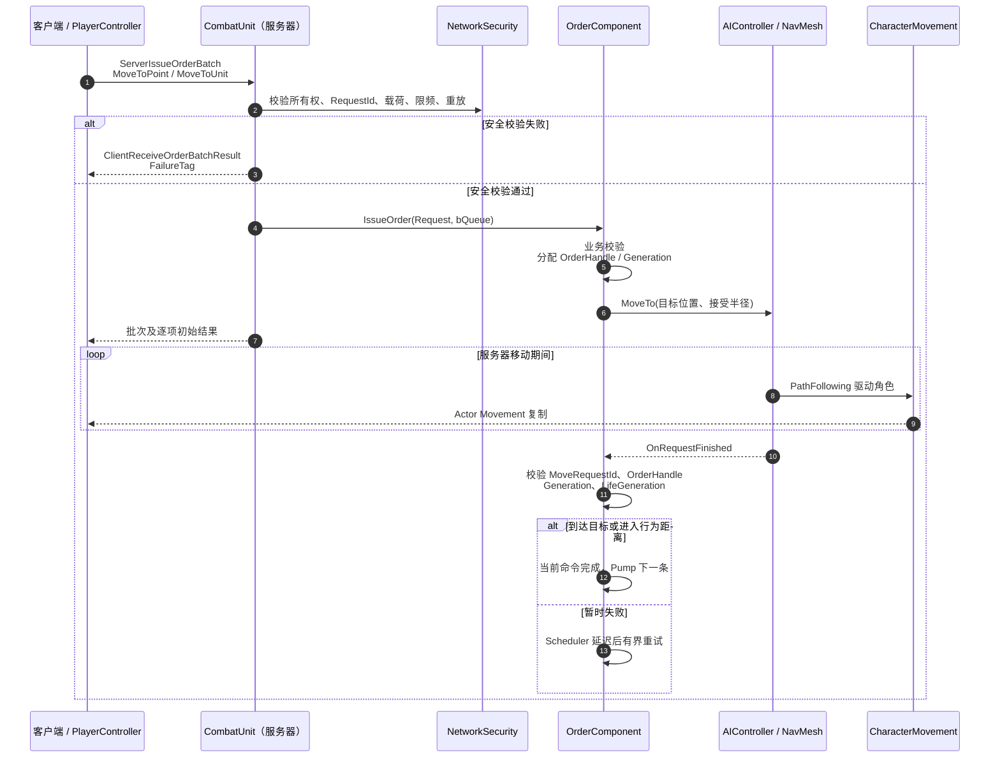
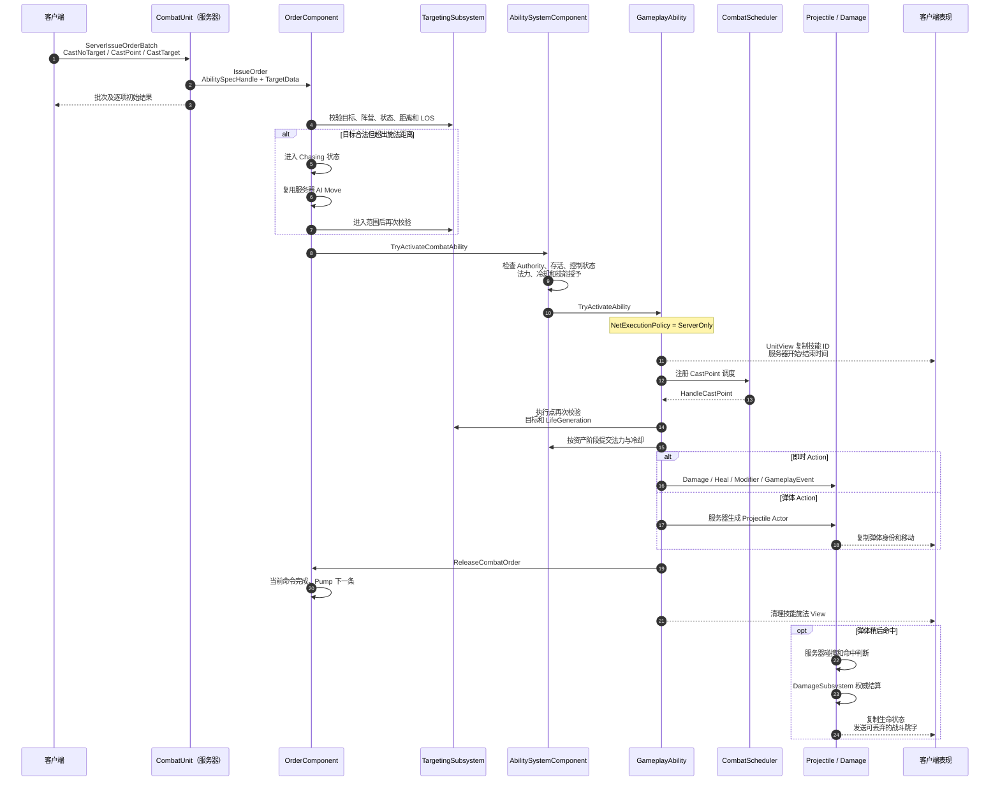

# 34 客户端与服务器交互流程

## 1. 定位与总览

Combat 使用 RTS/MOBA 风格的服务器权威命令模型。客户端负责选择单位、点击目标、构造 Order 请求和播放可丢弃的输入反馈；服务器负责 Order 执行、寻路、目标复核、Ability 激活、Projectile 命中、Damage/Heal/Modifier、死亡和最终状态复制。

它不是“客户端先执行完整移动或技能，服务器再确认”的高预测模型。当前公共链路为：

```text
客户端输入 / AI 意图
  -> FCombatOrderBatchRequest
  -> ServerIssueOrderBatch（Reliable）
  -> RPC 安全校验
  -> UCombatOrderComponent
  -> Move / Chase / Attack / Cast
  -> 服务器权威战斗子系统
  -> Movement、ASC、UnitView、Projectile 和表现 RPC 复制到客户端
```

玩家拥有的 Unit 仍由 `AIController` 负责服务器导航。服务器通过 `SetCommandingPlayerController` 把 `PlayerController` 设置为网络 Owner，并为未被玩家直接 Possess 的 Strategy Unit 建立 owning client RPC 通道；控制权、AI 导航权和战斗队伍是三个独立概念。

## 2. 统一命令入口

客户端移动、攻击和施法都使用同一个 `FCombatOrderBatchRequest`：

```text
RequestId                 同一连接重放窗口内唯一的正整数
bAppendToExistingQueue    首条命令追加或替换现有行为
Orders[]                  最多包含当前批次的多条 Order
```

单条 `FCombatOrderRequest` 根据类型携带目标 Unit、有限目标位置和 `AbilitySpecHandle`：

```text
MoveToPoint / MoveToUnit
AttackTarget
CastNoTarget / CastPoint / CastTarget
Stop
```

owning client 调用 `ACombatUnitCharacter::ServerIssueOrderBatch`。服务器先执行安全层校验，再逐条调用 `UCombatOrderComponent::IssueOrder`。当前默认限制为：

- 调用连接必须拥有 Unit，且 Unit 必须处于服务器 Authority。
- `RequestId > 0`，最近 128 个请求 ID 内不得重复。
- 每批最多 8 条 Order，估算载荷不超过 4096 bytes。
- 每连接 token bucket 按 20 requests/s 补充，突发容量为 32。
- 通过安全层后，OrderComponent 仍会逐条检查类型、目标、位置、AbilitySpec 和队列容量。

服务器通过 `ClientReceiveOrderBatchResult` 把结果可靠地返回给 owning client。结果分两层：

| 字段 | 含义 |
| --- | --- |
| `bAccepted` | 批次通过所有权、载荷、重放和限频检查 |
| `AcceptedOrderCount` | 实际通过逐项业务校验并进入 OrderComponent 的数量 |
| `OrderResults` | 每条 Order 的初始 Handle、状态或失败原因 |

这个回执只说明请求已被接收或拒绝，不承诺异步行为已经完成。移动到达、技能生效和弹体命中分别有自己的服务器生命周期。

## 3. 移动交互流程



### 3.1 服务器执行细节

1. `IssueOrder` 只允许服务器执行。`bQueue=false` 时先提升 Order generation、取消旧异步行为并替换队列；`bQueue=true` 时追加到 FIFO。
2. 服务器创建 `FCombatQueuedOrder`，分配稳定 `OrderHandle`，并快照当前 Unit `LifeGeneration`。
3. `PumpCurrentOrder` 复核 Unit 是否存活、generation 是否有效，以及 Root/Stun/Hex/Motion 等状态是否阻止移动。
4. `BeginMovement` 使用点目标或动态目标的服务器位置快照。普通点移动可先运行 EQS；追击直接进入服务器 `AIController::MoveTo`。
5. `FAIMoveRequest` 使用行为距离作为 AcceptanceRadius，允许 PartialPath，但最终必须用当前 gameplay 边缘距离再次裁决。
6. 动态目标默认每 0.10 秒通过 Combat Scheduler 复核；目标位移达到 50 cm 时停止旧 Move 并重发。单次持续追击默认最多 10 秒。
7. Move 完成回调必须同时匹配 `FAIRequestID`、OrderHandle generation 和 Unit LifeGeneration。旧请求、旧命令或旧生命回调直接失效。
8. Blocked、Invalid 或未满足行为距离的 PartialPath 进入有界重试；当前默认最多重试 3 次，每次延迟 0.20 秒。

### 3.2 客户端如何看到移动

`ACombatUnitCharacter` 开启 `bReplicates` 和 `SetReplicateMovement(true)`。项目层没有在客户端先执行一份权威 AI Move；服务器 CharacterMovement 的位置、旋转和速度通过 UE Actor Movement Replication 投影给相关客户端。

当前 `FOnCombatOrderFinished` 是 OrderComponent 的服务器原生委托，没有对应的最终完成 Client RPC。因此 UI 若只订阅 `OnOrderBatchResult`，只能显示“命令已接收/被拒绝”，不能把它显示成“已经到达”。如果产品需要可靠的最终订单状态，应新增明确、受限的状态投影，而不是复用初始 RPC 回执。

## 4. 施放技能交互流程



### 4.1 Order 到 Ability

1. Cast Order 使用客户端提交的目标 Unit 或目标点，但这些字段只是请求。
2. OrderComponent 首次调用 `UCombatTargetingSubsystem::ValidateAbilityTarget`。目标无效时失败；单位/点目标仅因距离不足时进入 `Chasing`。
3. 进入范围后取消移动、服务器转向，再调用 `TryActivateCombatAbility`。
4. ASC 重新检查服务器 Authority、Unit 存活、技能是否已授予/正在激活、Stunned/Hexed/Frozen/Silenced、目标规则、法力和冷却。
5. `UCombatGameplayAbility` 当前使用 `InstancedPerActor` 和 `ServerOnly`，客户端不会运行权威 GameplayAbility 实例。

### 4.2 前摇、提交与生效

1. Ability 激活后消费 ASC 保存的 Pending TargetData，并建立 RootEventId、Caster/Target LifeGeneration 和技能等级快照。
2. `AbilityCastStarted` 时把技能 DefinitionId、ActivationId、服务器开始/结束时间和 Channeling 标记写入 `UCombatUnitViewComponent`，供客户端施法条和动画使用。
3. CastPoint 大于零时使用 `UCombatSchedulerSubsystem::ScheduleOnce`；零前摇技能可以同步进入执行点。
4. CastPoint 到达后再次检查目标、距离、LOS 和 LifeGeneration，再按 AbilityData 的 Commit Stage 幂等提交 Cost/Cooldown。
5. `SpellBlock` 在 `SpellStarted` commit 之后消费，因此可能出现法力和冷却已经提交、但技能 Action 没有发生的结果。
6. DataDriven Action 统一进入 Damage、Heal、ApplyModifier、GameplayEvent、Projectile 或 Thinker 公共服务器入口，不能从蓝图直接改 Health 或自行完成命中结算。

### 4.3 Order 释放与 Projectile 命中是两个时点

非引导技能在 Action 成功后调用 `ReleaseCombatOrder`，引导技能通常在 Channel 结束时释放。OrderComponent 收到匹配的 AbilitySpecHandle 和 generation 后完成当前 Cast Order，并可以立即执行下一条命令。

这不代表技能的一切副作用都结束：

- Cast Order 不等待 cooldown 或纯表现 backswing。
- 默认 `bCancelProjectilesWithAbility=false`，服务器 Projectile 可以脱离 Ability 实例继续飞行。
- 弹体稍后命中时，ProjectileSubsystem 才调用 Damage/Modifier 等 Impact Action。
- 只有资产显式启用 `bCancelProjectilesWithAbility` 时，Ability 结束会批量取消属于本次 Activation 的弹体。

因此一次弹道技能可能出现如下合法顺序：

```text
技能生成弹体
  -> Cast Order 释放
  -> 单位开始下一条 Order
  -> 旧弹体稍后命中
  -> 服务器结算伤害并复制结果
```

## 5. 伤害、状态与表现返回客户端

DamageSubsystem 只接受服务器请求。它按固定管线执行权限/生命检查、免疫、Modifier 前置 Hook、抗性、护盾、Meta GameplayEffect 落账、后置 Hook、吸血、日志和致死转换。客户端不能提交最终 Amount、伤害 flags 或命中结果。

客户端可观察到的通道如下：

| 数据 | 网络方向 | 语义 |
| --- | --- | --- |
| `ServerIssueOrderBatch` | owning client -> server，Reliable | 提交移动、攻击或施法意图 |
| `ClientReceiveOrderBatchResult` | server -> owning client，Reliable | 安全层和逐项初始接收结果 |
| Character Movement | server -> relevant clients | 权威位置、旋转和速度的状态复制 |
| ASC Attribute/Tag/ActiveGE | server -> clients | 按 Mixed/Minimal/Full 策略复制 GAS 状态 |
| `FCombatUnitView` | server -> owner/non-owner | Health、Mana、LifeState、可见状态和施法时间窗 |
| Modifier FastArray | server -> owner/non-owner | 可见 Modifier 的增量投影，不复制 Runtime UObject |
| Projectile Actor | server -> relevant clients | 权威弹体身份、PredictionKey 和移动 |
| 战斗跳字 | server -> relevant clients，Unreliable multicast | 可丢弃的伤害/治疗视觉反馈，不参与 gameplay |

ASC 默认按 Unit 网络 Owner 自动选择复制模式：玩家拥有的 Unit 使用 Mixed，纯 AI Unit 使用 Minimal。Owner 与非 Owner UI 都优先读取 `UCombatUnitViewComponent` 的安全扁平投影；View 和 Widget 不能反向驱动服务器 gameplay。

Projectile 表现层允许客户端创建纯视觉预测对象，并通过 PredictionKey 与复制到达的服务器 Projectile reconcile。预测对象只能负责视觉，禁止 sweep、Damage、ApplyModifier、Finalize Attack 或生成权威事件。

## 6. 三个常见误解

### 6.1 `bAccepted=true` 不等于动作成功

它只表示 RPC 通过安全层。还需要检查逐项 `OrderResults`；即使初始 Order 被接受，后续仍可能因目标失效、状态阻止、无路径、前摇中断或执行点复核失败而结束。

### 6.2 客户端看到角色移动，不代表客户端拥有移动权威

客户端看到的是服务器 CharacterMovement 的复制结果。PlayerController Owner 用于拥有 RPC 通道和 ASC Mixed replication；实际 Strategy 导航仍由服务器 AIController 执行。

### 6.3 Cast Order 完成不等于技能所有效果完成

Order 只等到 `OrderReleased`。Cooldown、backswing、长期 Modifier、Thinker 和 fire-and-forget Projectile 有各自独立生命周期。

## 7. 源码定位

| 源码 | 职责 |
| --- | --- |
| [`CombatNetworkTypes.h`](../../Source/ue_gas/Combat/Network/CombatNetworkTypes.h) | Order 批次请求、回执和安全统计结构 |
| [`CombatNetworkSecuritySubsystem.cpp`](../../Source/ue_gas/Combat/Network/CombatNetworkSecuritySubsystem.cpp) | 所有权、载荷、限频和重放防护 |
| [`CombatUnitCharacter.cpp`](../../Source/ue_gas/Combat/Unit/CombatUnitCharacter.cpp) | owning RPC、客户端回执、Actor/ASC 复制策略 |
| [`CombatOrderComponent.cpp`](../../Source/ue_gas/Combat/Order/CombatOrderComponent.cpp) | Order 状态机、AI Move、追击、Ability 派发和异步失效 |
| [`CombatAbilitySystemComponent.cpp`](../../Source/ue_gas/Combat/Ability/CombatAbilitySystemComponent.cpp) | Ability 服务器预检、TargetData 暂存和 GAS 激活 |
| [`CombatGameplayAbility.cpp`](../../Source/ue_gas/Combat/Ability/CombatGameplayAbility.cpp) | 前摇、commit、Action、Channel、OrderReleased 和清理 |
| [`CombatProjectileSubsystem.cpp`](../../Source/ue_gas/Combat/Projectile/CombatProjectileSubsystem.cpp) | 权威弹体推进、命中 Action 和 exactly-once Finish |
| [`CombatProjectileActor.cpp`](../../Source/ue_gas/Combat/Projectile/CombatProjectileActor.cpp) | 弹体身份、移动复制和客户端表现 reconcile |
| [`CombatDamageSubsystem.cpp`](../../Source/ue_gas/Combat/Combat/CombatDamageSubsystem.cpp) | 权威伤害事务和致死入口 |
| [`CombatUnitViewComponent.cpp`](../../Source/ue_gas/Combat/View/CombatUnitViewComponent.cpp) | UI 安全 Unit/Modifier/Ability View 复制 |
| [`CombatOverheadWidgetComponent.cpp`](../../Source/ue_gas/Combat/UI/CombatOverheadWidgetComponent.cpp) | 头顶 UI 和不可靠伤害/治疗跳字 |

相关专题契约见 [03 Ability、目标与蓝图接口](03-Ability-Targeting-Blueprint.md)、[05 Damage 与 Heal 管线](05-Damage-Heal.md)、[06 普攻、法球、Projectile 与 Thinker](06-Attack-Projectile-Thinker.md)、[07 Order 与 NavMesh 移动](07-Order-Movement.md) 和 [08 数据、网络、UI 与可观测性](08-Data-Network-Observability.md)。
