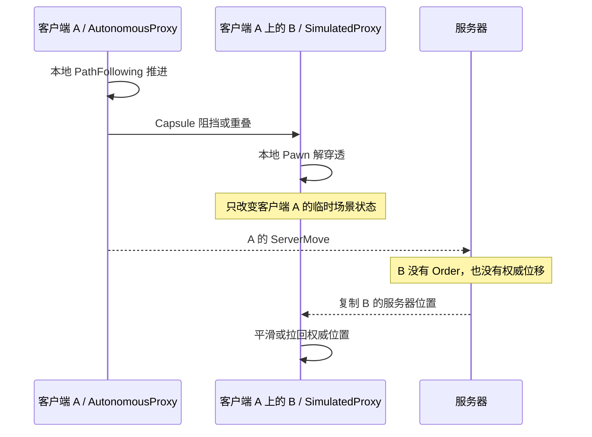
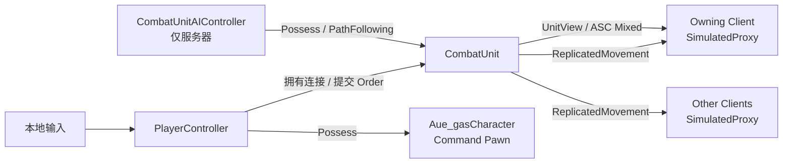
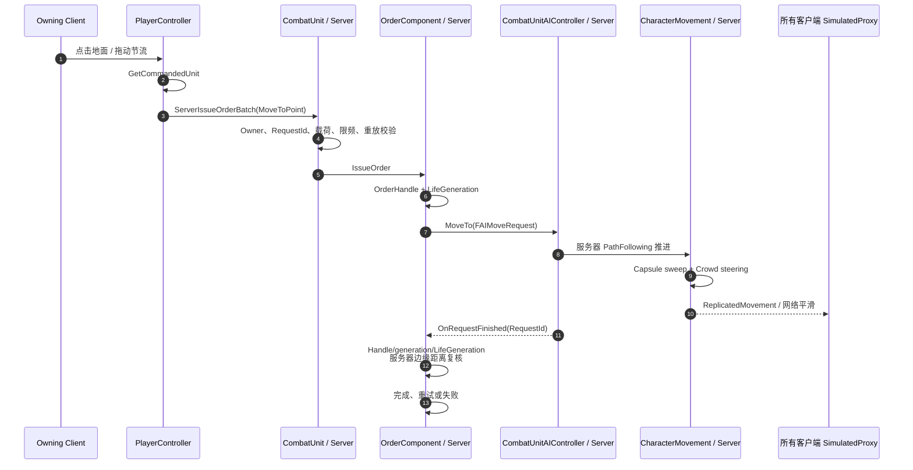

# 35 服务器权威单位移动改造与验收

> 文档状态：生产实现、验收反馈修正与 SAM Gate 重验已完成，等待用户复验。
> 决策/完成日期：2026-09-02。
> 执行状态以 [00 开发进度台账](00-Progress-Tracker.md) 为准；当前行为同步见 [01](01-Scope-Architecture.md)、[07](07-Order-Movement.md) 与 [34](34-Client-Server-Interaction.md)。

## 1. 背景与问题

改造前的 Combat Demo 由 `Aue_gasPlayerController` 直接 Possess `ACombatUnitCharacter`。服务器接收 Move Order、计算 NavMesh 路径并保存 Order 状态，但远端玩家控制的 Character 实际由 owning client 的 PathFollowing 驱动，再通过 UE CharacterMovement `ServerMove` 交给服务器验证。

这个旧兼容分支解决了“远端 PlayerController 的 Pawn 不会被服务器 PathFollowing 直接驱动”的问题，但引入了两个移动事实来源：

1. 服务器保存 Order、路径、目标和完成状态。
2. owning client 预测角色的逐帧移动与本地碰撞。

当客户端 A 的 AutonomousProxy 与客户端 A 上的单位 B SimulatedProxy 碰撞时，UE 可能在客户端 A 本地为 B 执行 Pawn 解穿透。B 没有收到服务器 Order，服务器位置也没有改变，因此形成“客户端看见 B 被挤开，服务器没有移动 B”的短暂分叉。后续位置复制只能把 B 拉回，表现为抖动、弹回或穿插。

问题链路如下：



这不是 Order RPC 丢失，也不是 `PushForceFactor` 一类物理刚体推力问题。根因是直接 Possess 模式允许客户端参与 Combat Unit 的移动模拟，而单位硬碰撞依赖另一个网络代理的滞后位置。

## 2. 目标与非目标

### 2.1 目标

- 所有普通 Combat Unit 的寻路、转向、碰撞、避让、到达判定和位置更新只在服务器执行。
- `PlayerController` 只提交 Order，不 Possess Combat Unit，不运行单位 PathFollowing，不发送单位 `ServerMove`。
- Combat Unit 无论是否归某个玩家指挥，在客户端都作为 `SimulatedProxy` 消费服务器移动复制。
- 保留现有 `ServerIssueOrderBatch` 安全边界、OrderHandle/generation、追击、技能、攻击和 ASC Mixed replication 语义。
- 保留 `CombatUnit` 对 `CombatUnit` 的硬阻挡，以服务器 Capsule sweep 作为最终几何约束；在此之上增加且只增加一种服务器避让实现。
- 解决单位控制权切换、断线、死亡/复活、Motion 抢占和临时 blocker 下的生命周期问题。
- 形成可自动验证的双客户端一致性 Gate，而不以“肉眼看起来正常”作为完成证据。

### 2.2 非目标

- 本轮不实现客户端移动预测、回滚或 lockstep。
- 本轮不实现完整多选编队、队形槽位、召唤物和幻象控制。
- 本轮不修改 Damage、Heal、Ability、AttackRecord 或 Projectile 的结算语义。
- 本轮不把单位间硬碰撞改成客户端物理推动；单位不会因为另一个客户端的碰撞而获得移动权威。
- 本轮不保证跨平台逐帧确定性。单个 Dedicated Server 的状态是唯一真值。
- 本轮不重写 NavMesh A*，继续使用 UE NavigationSystem 与 PathFollowing。

## 3. 核心决策与不变量

本设计落实 [ADR-043](12-Decisions-Gaps.md)：可玩 Combat Unit 统一采用“PlayerController 指挥、AIController Possess、服务器移动、客户端 SimulatedProxy”的拓扑。它强化 ADR-011 和 ADR-038，不改变 Team 与控制权分离、ASC 属性唯一来源或 `combat_v1_rc1` 的战斗结算契约。

### 3.1 当前拓扑

| 关系 | 当前值 | 职责 |
| --- | --- | --- |
| `PlayerController->GetPawn()` | `Aue_gasCharacter`（Command Pawn） | 接收玩家输入并提供摄像机，不参与 Combat 碰撞或结算 |
| `CombatUnit->GetController()` | `ACombatUnitAIController` | 仅服务器存在，拥有 PathFollowing 并执行移动 |
| `CombatUnit->GetOwner()` | 指挥该单位的 `PlayerController` 或空 | 建立 Order RPC owning connection 和 ASC Mixed replication |
| `PlayerController->CommandedUnit` | 当前主控 `CombatUnit` | 输入、技能栏、镜头和 UI 的显式目标 |
| Combat Unit 客户端网络角色 | `ROLE_SimulatedProxy` | 只消费服务器位置复制与网络平滑 |
| `FCombatTeamId` | 与 Controller/Owner 独立 | 继续由 TeamSubsystem 决定阵营关系 |



### 3.2 必须始终成立的不变量

1. 可玩地图中的 Alive Combat Unit 若允许普通移动，服务器上必须具有有效 `ACombatUnitAIController` 和 `UPathFollowingComponent`。
2. 玩家指挥权只通过 `CombatUnit.Owner` 与 `PlayerController.CommandedUnit` 表达，不通过 Possession 或 Team 推断。
3. 给单位设置玩家 Owner 时不得调用 `SetAutonomousProxy(true)`；网络所有权和移动网络角色必须分离。
4. owning client 也不得执行 Combat Unit 的 `RequestMove`、`AddMovementInput`、`SimpleMoveToLocation` 或客户端路径跟随。
5. Order 完成只由服务器 `OnRequestFinished` 加服务器当前位置复核推进；客户端不能上报“已到达”。
6. 普通移动、追击和服务器避让由 AIController/CharacterMovement 执行；强制位移仍只走 `UCombatMotionComponent`。
7. `CombatUnit` Capsule 的硬碰撞结果只在服务器具有 gameplay 意义；客户端解穿透不能生成 Order、Damage、状态或位移事件。
8. 迁移完成后生产代码只保留一种单位移动拓扑，不长期维护“直接 Possess”和“AI Possess”两套分支。

## 4. 组件设计

### 4.1 `ACombatUnitAIController`

已新增专用服务器 AIController，职责限定为：

- 提供单位的 PathFollowingComponent。
- 执行 `UCombatOrderComponent` 发起的 `FAIMoveRequest`。
- 在服务器运行所选的 crowd avoidance。
- 不保存玩家输入、技能槽、队伍或 Order 队列。
- 不成为 Unit 的网络 Owner，不拥有客户端连接。

当前使用 `UCrowdFollowingComponent`（Detour Crowd）替换默认 PathFollowingComponent。它仍继承 PathFollowing 公共协议，`UCombatOrderComponent` 继续绑定 `OnRequestFinished`、保存 `FAIRequestID` 并执行旧回调失效检查。Dedicated 64 Unit 容量与状态切换 Gate 已通过，未启用第二套 RVO。

### 4.2 `Aue_gasCharacter` Command Pawn

`Aue_gasCharacter` 已收敛为轻量命令 Pawn，作为 PlayerController 唯一 Possess 对象：

- 包含顶视角 Camera/SpringArm，或把视角交给 PlayerCameraManager。
- 不持有 ASC、Attribute、Order、Attack、Motion 等 Combat 组件。
- 不使用 `CombatUnit` Object Channel；默认无 gameplay collision、不可被 CombatTargeting 或 Projectile 查询。
- 镜头跟随属于客户端表现，可以平滑跟随 `CommandedUnit`，但不能回写 Unit transform。
- Command Pawn 丢失或重生不改变 Combat Unit 的生命代次、Order 或 Team。

原模板顶视角 `Aue_gasCharacter` 已从 `ACharacter` 改为无碰撞 `APawn`，只保留 SceneRoot、SpringArm、Camera 与本地跟随；项目没有保留第二个摄像机 Pawn 入口。

### 4.3 `Aue_gasPlayerController`

PlayerController 已增加显式的主控绑定：

```text
CommandedUnit                 owner-only replicated actor reference
CommandBindingGeneration     服务器递增的非零代次
SetCommandedUnitAuthority()  仅服务器调用，负责原子切换
OnRep_CommandedUnit()        刷新输入、镜头和 UI
GetCommandedUnit()           输入代码唯一查询入口
```

输入改造：

- `IssueCombatMoveOrder`、Q/W/E/R、选取和目标预览全部从 `GetPawn()` 改为 `GetCommandedUnit()`。
- `CommandedUnit` 未复制、已失效或 Owner 尚未同步时，输入只保留本地光标反馈，不发送 RPC。
- `NextCombatOrderRequestId` 继续按 PlayerController 连接单调递增。
- 继续调用 Unit 上的 `ServerIssueOrderBatch`，保持 ADR-038 与现有安全载荷；Dedicated 测试必须证明 SimulatedProxy + owning connection 仍能正确调用 Server RPC。
- 删除 PlayerController 上只服务直接 Possess 的 PathFollowingComponent、`ClientFollowCombatOrderPath` 与 `ClientStopCombatOrderNavigation`。

`CommandBindingGeneration` 用于 UI、镜头和异步本地回执去旧，不代替服务器 Owner 校验。若未来引入多单位控制，它扩展为服务器维护的受控单位集合；本轮只实现一个主控 Unit。

### 4.4 `ACombatUnitCharacter`

保留 `SetCommandingPlayerController`、`GetNetOwner`、`GetNetConnection` 和 ASC 自动复制策略，但调整职责：

- `SetCommandingPlayerController` 只设置或清除网络 Owner、刷新 ASC Mixed/Minimal 策略并 `ForceNetUpdate`。
- 删除其中的 `SetAutonomousProxy(NewController != nullptr)`；玩家 Owner 不再使单位成为 AutonomousProxy。
- 单位默认 `AIControllerClass` 指向 `ACombatUnitAIController`，`AutoPossessAI` 继续覆盖关卡放置与运行时生成。
- 增加服务器不变量检查：被玩家指挥不代表被 PlayerController Possess；发现直接 Possess 时记录错误并拒绝开始普通移动。
- `MaxDepenetrationWithPawnAsProxy` 初始设为 `0`，作为客户端防御性表现规则，禁止 SimulatedProxy 因其他 Pawn 在本机产生非权威位移。服务器 Authority 的 Pawn 解穿透不受该字段影响。

### 4.5 `UCombatOrderComponent`

Order 状态机、Handle、generation、LifeGeneration 和重试语义保持不变，只收敛导航执行器：

- `StartNavigationMove` 只接受 `AAIController`/`ACombatUnitAIController`。
- 统一通过 `AAIController::MoveTo` 获取 `FAIRequestID` 和 `FNavPathSharedPtr`。
- 删除 PlayerController 同步求路、PlayerController PathFollowing `RequestMove` 和客户端路径点下发分支。
- `CancelMovementAsync` 只停止服务器 Controller；不再发送客户端 Stop 导航 RPC。
- `OnRequestFinished` 后仍必须调用 `IsCurrentDestinationReached`，成功 PartialPath 不能跳过 gameplay 边缘距离复核。
- Controller 重建、死亡/复活和地图切换时仍通过现有 delegate 解绑、重绑和 generation 淘汰旧回调。

## 5. 控制权绑定与生命周期

### 5.1 初始绑定顺序

服务器必须由 `Aue_gasGameMode::SpawnDefaultPawnAtTransform` 按以下顺序建立玩家控制，避免嵌套 Possession 破坏 AI/Crowd 状态：

1. 将 GameMode 的 `DefaultPawnClass` 解释为玩家 Combat Unit 模板，生成或复用 Combat Unit。
2. 确保 Unit 已由唯一 `ACombatUnitAIController` Possess；必要时调用 `SpawnDefaultController`。
3. 单独生成 `Aue_gasCharacter` Command Pawn，但此时不嵌套调用 `PlayerController::OnPossess`。
4. 调用 `SetCommandedUnitAuthority`，设置 Unit 网络 Owner、PlayerController 的 `CommandedUnit` 并提升 `CommandBindingGeneration`。
5. GameMode 只把 Command Pawn 返回给引擎，随后由标准 `RestartPlayer -> Possess` 流程完成玩家占有。
6. `ForceNetUpdate`，客户端 `OnRep_CommandedUnit` 在 Owner 与 Unit 均可用后启用输入和镜头。

`BP_CombatDemoGameMode` 必须继承 `Aue_gasGameMode`。不得让通用 `GameModeBase` 先返回 Combat Unit，再尝试在 `PlayerController::OnPossess` 中切换成 Command Pawn；引擎进入该回调前已经解除 Unit 的旧 AIController，这会留下孤立 Crowd controller 并破坏实际移动执行。

客户端不能假定不同 Actor 的复制到达顺序。`OnRep_CommandedUnit` 必须允许 Unit 尚未完成 Owner/ASC 初始化，并在后续复制到达时幂等刷新。

### 5.2 切换或转移控制权

运行时从旧玩家转给新玩家时使用单一服务器事务入口：

1. 提升旧 Unit 的 Order generation，取消当前移动/攻击/施法并清空队列，失败原因使用稳定 Ownership/Cancelled 语义。
2. 清除旧 PlayerController 的 `CommandedUnit` 并提升其 BindingGeneration。
3. 清除 Unit 旧 Owner，刷新 ASC 复制策略。
4. 确认 AIController 仍在 Possess Unit；禁止新 PlayerController 直接 Possess。
5. 设置新 Owner，再设置新 PlayerController 的 `CommandedUnit`。
6. 结构化记录 OldController、NewController、Unit、BindingGeneration 和 LifeGeneration。

旧连接在转移后到达的 Order 必须被网络所有权校验拒绝。既有 Order 不继承给新玩家，避免上一位控制者的排队动作在新绑定下继续执行。

### 5.3 断线、死亡和复活

| 事件 | CommandedUnit | Unit Owner | AIController | Order |
| --- | --- | --- | --- | --- |
| 玩家正常断线 | 清空 | 清空或交给接管玩家 | 保留 | 默认取消并提升 generation |
| Unit Dying/Dead | 默认保留引用供 UI/复活 | 保留 | 保留但停止普通移动 | 由现有生命周期清理 |
| 同 Actor Respawn | 保留 | 保留 | 保留/重绑 PathFollowing | 新 LifeGeneration 下重新接收 Order |
| 销毁并换新 Unit | 指向新 Actor | 从旧 Actor 移除并设置新 Actor | 新 Unit 必须有效 | 旧 Actor 全部异步失效 |
| Command Pawn 重生 | 重新 Possess 新 Command Pawn | 不变 | 不变 | 不变 |

## 6. 目标移动时序



当前链路中不存在 `ClientFollowCombatOrderPath`、客户端 `RequestMove` 或 Combat Unit `ServerMove`。客户端即时反馈只包括光标、路径预览和 UI“命令已接收”；这些表现不能改变 Unit transform。

## 7. 碰撞、避让与 Motion 策略

### 7.1 硬碰撞

- `CombatUnit` 对 `CombatUnit` 继续为 `Block`，服务器 Capsule sweep 是最终防穿透约束。
- 客户端 Capsule 保留查询与复制表现，但 SimulatedProxy 对 Pawn 的本地最大解穿透为 0；客户端不得据此裁决能否到达。
- `CombatUnitNoCollision`、`CombatCorpse`、Projectile 和 CombatBlocker 的现有响应矩阵不变。
- 不启用物理模拟来推动 Character；`bEnablePhysicsInteraction`、`PushForceFactor` 和刚体 Repulsion 不是单位阻挡方案。

### 7.2 服务器避让

当前使用 Detour Crowd，并明确禁用 CharacterMovement RVO，避免双重 steering：

```text
NavMesh 全局路径
  -> UCrowdFollowingComponent 局部速度/走廊调整
  -> CharacterMovement 服务器 sweep
  -> CombatUnit Capsule 硬阻挡兜底
```

Crowd 容量已配置为 128，并通过 64 Unit/256 Modifier 容量 Gate。采样质量、邻居范围、分离权重和转向参数集中在 `ACombatUnitAIController` 与项目设置中，不散落在 Order 或技能代码中。

### 7.3 特殊状态

| 状态 | PathFollowing | Crowd | Capsule |
| --- | --- | --- | --- |
| Alive 普通移动 | 启用 | 启用 | `CombatUnit` |
| Rooted/Stunned/Hexed | 按现有 Order 规则停止或暂停 | 暂停 steering | `CombatUnit` |
| Motion active | 停止普通 MoveRequest | 暂停 steering | 按 Motion/状态规则保持 |
| `State.NoUnitCollision` | 可继续普通移动 | 不参与单位 avoidance | `CombatUnitNoCollision` |
| Dying/Dead | 停止 | 移出 crowd | `CombatCorpse` |
| Respawn | 重绑后允许 | 重新加入 | `CombatUnit` 或当前状态 Profile |

Motion 结束后由现有 Order 恢复入口重新验证当前队首并按需重新寻路，不能简单恢复旧速度或旧 corridor。

### 7.4 临时阻挡

Fissure 等 `CombatBlocker` 继续采用“物理阻挡立即正确 + 主动取消受影响 MoveRequest 并重寻路”的策略。Crowd 只负责局部避让，不能替代 blocker 相交检测、导航重建或 Order attempt generation。

## 8. 兼容边界与删除清单

### 8.1 保留

- `FCombatOrderBatchRequest`、`ServerIssueOrderBatch` 及其安全限制。
- Unit owning connection 与 `GetNetConnection` 覆盖。
- 玩家拥有 Unit 的 ASC Mixed replication。
- OrderHandle、NavigationAttemptGeneration、LifeGeneration 和旧回调淘汰。
- Move/Attack/Cast/Stop 队列、追击、EQS 候选点、PartialPath 复核和有界重试。
- `UCombatMotionComponent` 作为强制位移唯一入口。

### 8.2 最终删除

- `Aue_gasPlayerController::PathFollowingComponent`。
- `ClientFollowCombatOrderPath` 与 `ClientStopCombatOrderNavigation` RPC。
- `UCombatOrderComponent::StartNavigationMove` 的非 AIController 分支。
- `SetCommandingPlayerController` 中把 Unit 设置为 AutonomousProxy 的逻辑。
- 输入代码中通过 `GetPawn()` 获取 Combat Unit 的假设。
- 只验证 PlayerController PathFollowing 绑定的旧 Automation 用例。

旧用例不能简单删除而不补测试；必须由“AIController 绑定 + SimulatedProxy owning RPC + Dedicated 位置一致性”覆盖其原保护目的。

## 9. 分阶段实施记录

SAM-000..009 已按下列依赖完成；兼容分支已删除，没有 Shipping 双模式开关。

| Task | 内容 | 主要改动 | 完成标准 | 依赖 |
| --- | --- | --- | --- | --- |
| SAM-000 | 设计冻结 | 本文、ADR-043、台账与导航 | 文档一致性检查通过 | 无 |
| SAM-001 | 拓扑不变量与诊断 | 增加 Controller/Owner/Role/BindingGeneration 诊断和测试 helper | 能明确识别直接 Possess、错误 AutonomousProxy 和无 AIController | SAM-000 |
| SAM-002 | 服务器 AI 导航器 | 新增 `ACombatUnitAIController`，让 Unit 默认由其 Possess | 服务器 MoveTo、Stop、追击和旧回调测试通过 | SAM-001 |
| SAM-003 | Command Pawn 与绑定 | 新增/收敛 Command Pawn；PC 复制 CommandedUnit；GameMode 建立绑定 | 两客户端各自拥有 Command Pawn，各自只指挥自己的 Unit | SAM-002 |
| SAM-004 | 输入与网络角色迁移 | 输入改读 CommandedUnit；Owner 与 SimulatedProxy 分离 | owning client 能发 Order，但不产生 Unit `ServerMove` | SAM-003 |
| SAM-005 | 删除客户端路径分支 | 删除路径下发 RPC、PC PathFollowing 和非 AI Move 分支 | 全仓无生产引用，Move/Stop/replace 正常 | SAM-004 |
| SAM-006 | 碰撞与 Crowd | SimProxy Pawn 解穿透策略、Detour Crowd、状态切换与容量配置 | 对撞/交叉/同点移动稳定，Motion/NoCollision/Dead 正确 | SAM-005 |
| SAM-007 | Demo 资产迁移 | GameMode、Pawn、Unit Blueprint 与地图配置 | Editor 回读、蓝图编译和资产校验通过 | SAM-003..006 |
| SAM-008 | 回归与 Dedicated Gate | Automation、Editor/Server/Client、双客户端延迟/丢包与容量测试 | 第 11 节 Gate 全绿并保存日志证据 | SAM-007 |
| SAM-009 | 当前行为文档切换 | 更新 01/07/34 和源码定位，移除“目标/当前”过渡提示 | 文档只描述已实现行为，无遗留双语义 | SAM-008 |

建议提交边界：

1. 诊断与不变量测试。
2. AIController + Order 服务器导航。
3. Command Pawn + PlayerController 绑定与输入。
4. 删除客户端路径执行。
5. Crowd/碰撞状态与资产迁移。
6. Dedicated 证据与当前文档切换。

## 10. 预期代码与资产改动面

| 路径 | 已完成变更 |
| --- | --- |
| `Source/ue_gas/Combat/Unit/CombatUnitAIController.*` | 新增服务器单位 AIController 与 CrowdFollowing 配置 |
| `Source/ue_gas/Combat/Unit/CombatUnitCharacter.*` | AIControllerClass、Owner/Role 分离、代理解穿透和不变量检查 |
| `Source/ue_gas/Combat/Order/CombatOrderComponent.*` | 收敛为 AIController 服务器 MoveTo，删除客户端路径分支 |
| `Source/ue_gas/ue_gasPlayerController.*` | CommandedUnit 绑定、输入迁移、删除 PathFollowing/RPC |
| `Source/ue_gas/ue_gasCharacter.*` 或新 Command Pawn | 摄像机 Pawn，无 Combat collision/gameplay |
| `Source/ue_gas/ue_gasGameMode.*` | 初始 Unit 分配、控制权事务和断线清理 |
| `Source/ue_gas/Combat/Tests/*` | 拓扑、Owner、Role、Order、碰撞和生命周期自动化 |
| `Content/Combat/Demo/Framework/BP_CombatDemoGameMode.uasset` | 通过 UE MCP 重设父类为 `Aue_gasGameMode`，保留现有 DefaultPawnClass/PlayerControllerClass 配置并启用原生出生编排 |
| `Config/DefaultEngine.ini` | 默认地图/GameMode 指向 Combat Demo；CrowdManager 容量设为 128；冻结 Profile 名称不变 |

二进制资产必须通过 UE MCP/Editor 受控修改、回读、编译并保存；不能用文本工具直接改写 `.uasset` 或 `.umap`。

## 11. 测试矩阵与验收 Gate

### 11.1 C++ Automation

- `CommandedUnit` 绑定、幂等重绑、清空和 BindingGeneration 单调递增。
- Demo GameMode 资产继承原生出生编排器；默认出生只创建一个 Unit AIController，且不存在孤立 Combat AIController。
- AIController Possess 后再设置 PlayerController Owner，不会丢失 AIController。
- 玩家拥有的 Unit 保持 ASC Mixed，但移动角色为 SimulatedProxy。
- 纯 AI Unit 保持 Minimal；Team 不因 Owner/Controller 变化而改变。
- 非拥有者、旧拥有者、NaN、重放、过频和超载荷 Order 仍被拒绝。
- Order Move/Stop/replace、追击、PartialPath、重试和旧回调淘汰保持原语义。
- Motion 抢占时停止服务器 Move，结束后只恢复当前有效 Order。
- `State.NoUnitCollision`、Dead、Respawn 正确切换 Collision/Crowd 并清理旧请求。
- Owner 转移和断线取消旧 Order，旧 generation 不能推进新绑定。

### 11.2 Network PIE 快速回归

至少两个客户端，覆盖 Listen Server 与 Dedicated PIE：

1. 客户端 A 移动撞向静止 B；B 在服务器和两个客户端都不得获得持续位移。
2. A/B 同时相向移动、交叉移动、移动到同一点；最终位置与服务器收敛，无客户端单边推走。
3. 移动过程中连续 replace、Stop、Root、Motion、Death/Respawn。
4. Attack/Cast 因距离不足追击，到达后服务器复核并执行。
5. Fissure 生成/消失触发重寻路，没有旧 PathFollowing 回调推进新 Order。
6. owning client 的 Unit 本地角色为 SimulatedProxy，PlayerController Pawn 为 Command Pawn。

### 11.3 Dedicated 双客户端最终 Gate

必须使用独立 Server + 2 Client 进程，不能只用单进程 PIE 代替：

- Editor、Server、Client Development Target 均构建成功。
- 完整 `Combat.*` Automation 全绿，测试数量不得无说明下降。
- Demo 相关 Blueprint 编译、资产回读与 `CombatAssetValidation` 全绿。
- 基础 RTT、约 80 ms、约 150 ms 三档网络条件；至少增加 2% packet loss 场景。
- 对撞场景记录 Server/A/B 三端位置。静止 B 未收到 Order 时，服务器位移应为 0（允许浮点容差），客户端最终误差不超过项目网络平滑容差，并在稳定窗口内收敛。
- 日志证明 Combat Unit 没有客户端路径 RPC、没有客户端 `RequestMove`，拥有者客户端角色仍是 SimulatedProxy。
- 64 Unit 容量场景重新采样，继续满足已冻结的 30 Hz p95/p99 和单连接带宽预算；若超预算，先 profiler 定位再优化。
- Server/Client 退出后 PathFollowing delegate、Crowd agent、Order schedule 和 Unit owner 计数归零。

### 11.4 完成定义

以下完成条件均已满足：

1. 可玩 Demo 不再直接 Possess Combat Unit。
2. 生产代码不包含客户端 Combat Unit PathFollowing 分支。
3. owning client 对所控 Unit 也是 SimulatedProxy，Order RPC 与 ASC Mixed replication 仍工作。
4. 双客户端对撞无法在任一客户端制造服务器未认可的持久位移。
5. Move、Attack、Cast、Stop、Motion、死亡/复活和 blocker 全部通过相关 Gate。
6. 当前行为文档 01/07/34 已从过渡说明切换到真实实现，并保存 Dedicated 日志证据。

### 11.5 2026-09-02 Gate 结果

| Gate | 结果 | 证据 |
| --- | --- | --- |
| 三 Target | 通过 | Installed UE 5.8.1 `ue_gasEditor` 与源码 UE 5.8.0 `ue_gasServer`/`ue_gasClient` Development 均 `Result: Succeeded` |
| SAM Automation | 3/3 | `CommandBindingLifecycle`、`CrowdStateLifecycle`、`ServerAiCrowdNavigationBinding` 全部 Success；覆盖控制转移、Unit EndPlay、死亡/复活、Motion 和 Crowd teardown |
| 完整 Automation | 44/44 | `Combat.*` 全量发现 44 项，全部 Success，测试数从 M8 的 40 增加 3 项 SAM 与 1 项既有后续用例，无无说明下降 |
| Blueprint / 资产 | 通过 | `CompileAllBlueprints -ProjectOnly` 为 0 Error/0 Warning；`CombatAssetValidation` 扫描 7 个资产、0 Error/0 Warning，报告为 `Saved/CombatValidation/SAMAssetReport.json` |
| Dedicated 基线 + 容量 | 通过 | 独立 Server + 2 Client；64 Unit/256 Modifier、Mixed=2/Minimal=62；p95 16.126 ms、p99 16.322 ms、单连接最大发送 4.748 KiB/s；静止 Unit 水平净位移 0.000 cm |
| 约 80 ms RTT | 通过 | Server/双 Client 均确认 `PktLag=40`；两端 RPC 成功且 UnitLocalRole=1；静止 Unit 水平净位移 0.000 cm |
| 约 150 ms RTT + 2% loss | 通过 | Server/双 Client 均确认 `PktLag=75`、`PktLoss=2`；两端 RPC 成功且 UnitLocalRole=1；静止 Unit 水平净位移 0.000 cm |
| 生命周期清零 | 通过 | Automation 显式覆盖 Unit Destroy→EndPlay 清空 CommandedUnit/提升 generation，以及 Controller UnPossess 禁用 Crowd agent；原 M8 World teardown 回归继续全绿 |

Dedicated 日志保存在 `Saved/Logs/SAM_Server_Base_20260902.log`、`SAM_Client1_Base_20260902.log`、`SAM_Client2_Base_20260902.log`，以及对应的 `RTT80`、`RTT150_Loss2` 三端文件。运行时日志还证明两个 Client 实际 Possess `ue_gasCharacter` Command Pawn，指挥 Unit 为 SimulatedProxy，服务器 `PathFollowingClass=CrowdFollowingComponent` 且拓扑 `Valid=Yes`。

初始实现会话没有可调用的 UE MCP 工具，因此按 [13](13-UE-MCP-Workflow.md) 的安全降级规则完成了当时的资产扫描和运行时回读；验收反馈修正会话已使用 UE MCP 重设、编译、保存并回读 `BP_CombatDemoGameMode` 父类，没有使用文本工具改写二进制资产。

### 11.6 2026-09-02 验收反馈修正结果

用户反馈“启动 PIE，点击右键并不能移动”。诊断确认右键 RPC、Order 接收、NavMesh 路径和 CrowdFollowing 请求均有效，但 GameMode 仍把 Combat Unit 当作 PlayerController 默认 Pawn；Unit `BeginPlay` 先生成 AIController，随后 PlayerController 的嵌套 `OnPossess` 再生成一个 AIController，单人场景因此出现 2 个 Unit/3 个 Combat AIController，移动速度始终为零。

修正后：

- `Aue_gasGameMode` 在标准默认出生阶段独立生成 Unit 与 Command Pawn，先绑定唯一 AIController/Owner，只返回 Command Pawn；PlayerController 不再负责嵌套拓扑迁移。
- `BP_CombatDemoGameMode` 已通过 UE MCP 重设父类为 `Aue_gasGameMode`，编译、保存和父类回读成功。
- `Combat.SAM.CommandBindingLifecycle` 改走真实 GameMode 出生入口，并断言 Combat AIController 数量为 1、孤立数量为 0；`Combat.Foundation.Content.AssetManagerAndTestMap` 增加 Demo GameMode 父类与默认类配置断言。
- 单人 PIE 为 2 Unit/2 Combat AIController；右键后玩家 Unit 从 `(1200, 1069)` 移至约 `(1039, 1458)`，水平位移约 420 cm，服务器记录 `Movement destination reached`。
- 双人 PIE 为 3 Unit/3 Combat AIController；没有新增 `SAMDirectCombatUnitPossessRejected`，本地右键移动实际推进约 324 cm。
- Editor、Server、Client Development Target 均编译成功，完整 `Combat.*` 为 44/44；资产校验报告扫描 7 个资产、0 Error/0 Warning。
- 同版本 UE 5.8.1 独立 Server + 两个独立 Client smoke 中，两端 Unit 均为 `LocalRole=1` 并成功提交 RPC；移动 A 的服务器水平净位移为 `324.508 cm`，静止 B 为 `0.000 cm`，结果 Pass。日志位于 `Saved/Logs/SAMFixInstalled_Server_20260902.log` 及对应 Client1/Client2 文件。

源码 UE 5.8.0 的 Server/Client Target 编译通过；由于本次蓝图由安装版 UE 5.8.1 保存，5.8.0 独立进程不能读取更高补丁版本的资产包，因此运行时 Dedicated smoke 使用相同资产版本的 UE 5.8.1 独立进程完成。该环境差异不影响三 Target 的编译结论。

## 12. 可观测性

开发和测试构建至少记录以下结构化字段：

```text
Unit
ControllerClass
CommandingPlayerController
CommandBindingGeneration
LocalRole / RemoteRole
OrderHandle / MoveRequestId / NavigationAttemptGeneration
PathFollowingClass
CrowdSimulationState
CollisionProfile
LifeGeneration
```

已增加一次性拓扑日志和按需 debug dump，且不在 Shipping 每帧打印位置。对撞测试额外记录开始/结束位置、服务器水平净位移和收敛结果。

发现下列状态时应在开发构建中 `ensure` 或至少 Error 日志：

- PlayerController 直接 Possess Alive Combat Unit。
- 玩家 Owner Unit 的 RemoteRole 为 AutonomousProxy。
- 普通移动开始时 Controller 不是 `ACombatUnitAIController`。
- 同一 Unit 同时启用 Crowd steering 与 CharacterMovement RVO。
- Order 已取消，但对应 PathFollowing/Crowd 请求仍能推进状态。

## 13. 风险验证结果与保留策略

| 风险 | 验证结果 | 保留策略 |
| --- | --- | --- |
| SimulatedProxy 所有者 RPC | 三档 Dedicated、两个独立客户端均完成 RPC smoke，UnitLocalRole=1 | RPC 继续由 Unit 承载；若未来所有权模型改变，另开 ADR |
| AI Possess 覆盖 Unit Owner | 绑定顺序、不变量与控制权转移 Automation 通过 | 固定“先 AI Possess、后设置 Player Owner”；销毁时使用弱引用锚点清理绑定 |
| CommandedUnit 与 Owner 跨 Actor 复制乱序 | OnRep/GetReady 与 Dedicated 登录、发令均通过 | 保持幂等 OnRep、未就绪禁发和 BindingGeneration 去旧 |
| owning client 输入延迟 | 80 ms 与 150 ms RTT + 2% loss 场景可完成发令与收敛 | 保留即时光标/路径预览；移动预测只能通过新 ADR 引入 |
| Crowd 与硬碰撞卡死或超容量 | 64 Unit/256 Modifier 容量与静止目标对撞 Gate 通过 | 保留有界重试、目标分散/EQS 和 Capsule 硬阻挡 |
| Motion/NoCollision/Dead 状态泄漏 | Crowd 状态生命周期 Automation 通过 | 状态统一刷新；继续覆盖完成、取消、死亡、复活与 UnPossess |
| 服务器 CharacterMovement 成本 | 容量基线 p95 16.126 ms、p99 16.322 ms，带宽在预算内 | 后续只按 profiler 证据优化 |
| Demo Blueprint/相机迁移 | 验收修正确认 GameMode 必须继承原生出生编排器；UE MCP 编译/保存/回读、7 个资产校验和 Dedicated 运行时通过 | Automation 固定父类与默认类配置；资产变更继续使用 UE MCP；不可用时遵循 Editor 安全降级流程 |

## 14. 回滚策略

- 每个 SAM 阶段保持可编译并独立提交，回滚以完整提交为单位。
- SAM-005 删除客户端路径分支之前，可以通过回退尚未合并的阶段提交恢复旧 Demo；不增加 Shipping 运行时双模式开关。
- SAM-005 之后如果 Crowd 有问题，只回退 SAM-006 Crowd 配置，保留 AIController 服务器移动，不回退到客户端 PathFollowing。
- 已写入新网络/资产格式的数据若需要回滚，先确认没有存档或版本兼容影响；本方案默认不改变 DataAsset schema 和 Combat Event schema。

## 15. 完成检查表

- [x] SAM-001..009 按依赖实施，`00` 保持为唯一状态源。
- [x] 开工前确认 Editor/Live Coding 状态并保留用户已有文档修改。
- [x] 初始实现按安全降级流程完成回读；验收反馈修正已使用 UE MCP 重设、编译、保存和回读 Demo GameMode 父类。
- [x] 先增加拓扑诊断与失败测试，再修改 Possession。
- [x] 验证 AIController Possess + PlayerController Owner + SimulatedProxy RPC 的最小 Dedicated 链路。
- [x] 迁移输入与原生入口，并删除客户端路径分支；Demo GameMode 二进制资产只通过 UE MCP 修改，未使用文本工具改写。
- [x] 执行第 11 节完整 Gate，记录日志、测试数与资产报告。
- [x] Gate 全绿后将 01/07/34 切换为当前实现。
