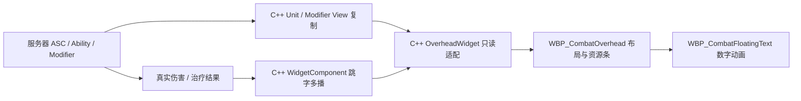

# 36 头顶 UI：C++ 与蓝图边界

> 2026-09-07，ADR-045。实现已迁移到 Widget Blueprint；验证结果以 [进度台账](00-Progress-Tracker.md) 为准。

## 1. 职责与数据方向

- `UCombatUnitViewComponent` 投影 UI 可见状态；权威属性仍只来自 ASC。FastArray 在一次接收完整应用后通知观察者。
- `UCombatOverheadWidgetComponent` 创建并挂载 Widget，接收服务器真实伤害/治疗的可丢弃跳字；专用服务器不创建 UMG 对象。
- `UCombatOverheadWidget` 是蓝图父类：管理 View 绑定、初始快照、状态归并、服务器时间、生命代次和重建；不创建资源条或文字控件。
- `WBP_CombatOverhead` 管理控件树、样式、可见性和血量拖影；`WBP_CombatFloatingText` 管理单条数字的文字、轨迹、缩放和淡出。
- 蓝图只消费展示快照和事件；不读取 Modifier Runtime，不订阅 ASC，不写资源，不发送战斗请求。

| 要修改的内容 | 维护入口 |
| --- | --- |
| 字体、边框、资源条高度、间距、布局 | `WBP_CombatOverhead` 的 Designer |
| 友方/敌方/中立色、施法/引导色 | 头顶蓝图默认值 `FriendlyColor` / `HostileColor` / `NeutralColor` / `CastColor` / `ChannelColor` |
| 受伤后的血量缓降速度 | 头顶蓝图 `LagSpeed`；治疗、最大生命变化与重生立即对齐 |
| 分段数量 | `HealthPerSegment` 与“刷新血条分段”；按最大生命计算段数，等宽布局，最多 12 段 |
| 控制状态名称、颜色和优先级 | 头顶蓝图默认值“控制状态展示规则”；归并和无限来源优先规则由 C++ 执行 |
| 跳字颜色、存续时长、上浮幅度与轨迹 | `WBP_CombatFloatingText` 的默认值与 Event Tick |
| 单位/技能显示名 | 对应 Combat DataAsset 的“显示名称”；支持本地化，空值回退稳定定义名 |
| 数据来源、阶段定义、观察者队伍、绑定清理与网络载荷 | C++ View、Widget 适配类与 WidgetComponent |

## 2. 展示接口 v2

展示接口和 Unit View 投影版本独立于冻结的 `combat_v1_rc1`；核心 Contract/Content/GameplayTag/Formula/RNG/Event schema 不变。

展示数据变化、活动进度变化、跳字请求和清空表现是四类事件。资源/状态由变化驱动；连续倒计时使用校准服务器时间；本地视觉动画不参与 Combat Scheduler 或权威技能结束。

蓝图 EventGraph 分别实现“展示数据已变化”“展示进度已变化”“收到战斗跳字”“清空头顶表现”。跳字通过“创建战斗跳字”取得子控件后添加到 Canvas；子蓝图在“初始化跳字表现”中接收已校验的数值、类型、生命代次与本地序号。C++ 不依赖血条、文字或 Canvas 的控件名称，Designer 改布局不需要修改 C++。

施法投影新增明确的 Casting/Channeling 阶段，时间窗对应当前阶段。保留 `bChanneling` 的“技能配置为引导”含义供旧消费者兼容；新 UI 读取阶段。服务器仍通过原 Ability/Scheduler 生命周期推进，UI 到期不执行技能结束。

服务器内部 `FCombatEventId.Sequence` 不在客户端投影中；UI 显示条件只依赖已复制的技能定义、阶段和有效时间窗，不能要求服务器事件序号有效。

跳字在服务器结果发生时记录目标 LifeGeneration；接收方丢弃旧生命数字。该内部 RPC 载荷要求服务器和客户端使用同版本构建，不支持混用旧可执行文件。

状态选择按蓝图配置的优先级与稳定标签顺序进行。同一状态只要有无限持续来源就显示无期限，否则取最晚结束来源；不以本地倒计时结束推断服务器状态消失。

## 3. 生命周期

绑定由 C++ 持有弱引用和运行时委托。重复初始化不重复订阅；更换单位、组件 EndPlay 和 Widget Destruct 清空旧表现并解绑。生命代次变化清空数字、动画缓存和旧名称加载请求，保留有效的同一 View 订阅。Widget 重建后恢复订阅并重送当前完整快照。名称异步回调同时检查绑定版本与生命代次，拒绝旧结果。编辑器设计预览只使用预览数据，不绑定关卡对象。

蓝图创建的跳字由头顶 Widget 持有，最多 12 条；单条动画完成后移除，父 Widget 清空时统一结束。初始复制未就绪时不显示零值假状态。

## 4. 资产迁移

1. 创建 `/Game/Combat/Demo/UI/WBP_CombatOverhead` 和 `WBP_CombatFloatingText`。
2. 玩家与木桩的 `CombatOverheadUI.WidgetClass` 指向头顶蓝图，保持屏幕空间与挂载位置。
3. 纯 C++ 单位默认不指定视觉资产；生产角色通过蓝图显式配置。头顶组件可空，Damage/Heal 正常工作。
4. Combat 定义兼容新增本地化显示名；空值回退稳定 ID 文本。DefinitionId、schema 与平衡数值不变。
5. AssetManager 的 CombatUnit、CombatAbility 扫描增加 `/Game/Combat/Demo`，确保 Demo 名称可按稳定 ID 解析；其余定义类型扫描规则不变。

## 5. 验证结果（2026-09-07）

- Editor Development 最终模块 `9140`、Server Development、Client Development 构建通过。
- 完整 `Combat.*` 为 53/53，0 测试警告；新增 3 项头顶 UI 用例覆盖状态归并、前摇/引导与中断、客户端缺少服务器事件序号、蓝图绑定/重建、旧生命和 Owner/World 清理。
- 两个 Widget Blueprint 与两个角色蓝图编译通过，配置资产保存并冷启动回读；`CombatAssetValidation` 检查 7 个 Combat 定义，0 Error / 0 Warning。资产检查数量不代表 Widget Blueprint 数量。
- Listen Server + 一个客户端的真实 Demo PIE 完成 12 个阶段核对：资源、缓降、治疗、控制与驱散、前摇、引导、原生投射物网络跳字、结束、死亡与重生。重生后两端生命代次为 2、生命 500、无旧数字，血量缓降缓存归一。
- 最终模块独立 Dedicated Server + 两客户端通过加入、正式 Order RPC、64 单位 / 256 Modifier 容量与服务器移动 smoke；静止单位水平位移为 0，容量预算为 Pass。

证据和可复现命令见 `Saved/OverheadBlueprint/Validation.md`、`AutomationFinal2/index.json`、`AssetReportFinal.json`、`PieSmoke.json` 和 `Dedicated*Final.log`。本次未执行完整 cook / 打包；Dedicated 使用安装版 UE 5.8.1 的 `-server/-game`，Server/Client Target 使用本机源码版 UE 5.8 编译。Dedicated 日志仍包含既有工具插件初始化和 Mixed ASC 动态 GE 定义告警，不将其描述为日志零错误。
